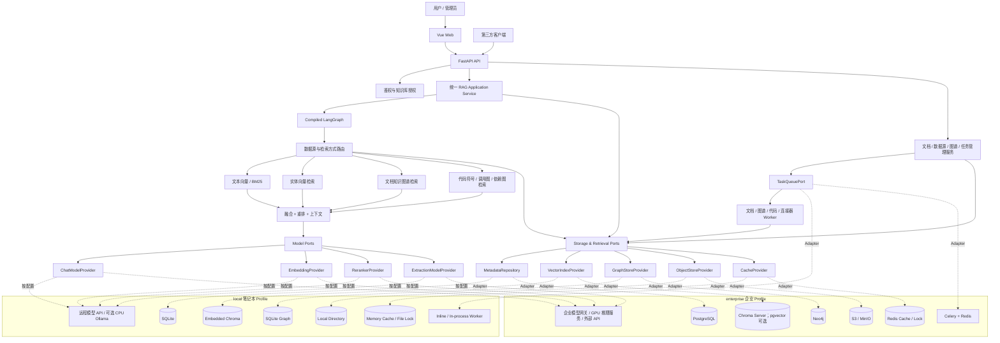
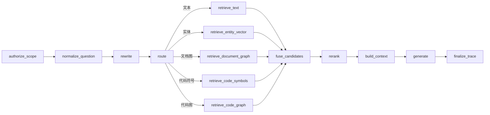
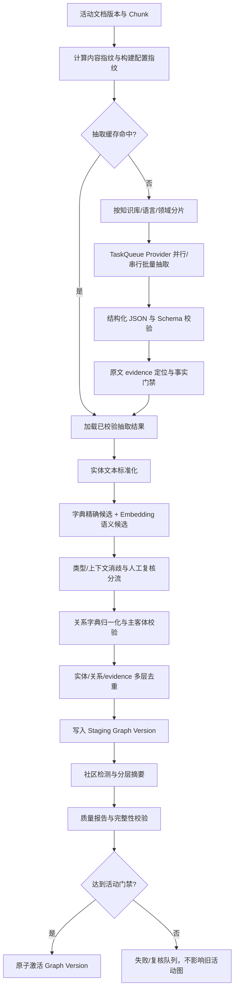

# Enterprise RAG 改造和新增功能实现方案

> 版本：1.2
> 编制日期：2026-08-07
> 适用基线：当前 `ragflow-enterprise` 仓库
> 状态：已按部署可移植性范围修订，待评审

## 1. 方案摘要

本方案仍适合当前项目，但需要从“直接切换到一组生产组件”调整为“先解耦、再按环境替换实现”。这里的企业迁移特指**部署可移植性**：同一套 RAG 应用代码在本地笔记本和企业服务器都能运行，服务器通过配置更换受支持的模型、关系库、向量库、图数据库、对象存储和任务队列后，即可重新上传文档并使用 RAG；**不要求搬迁本地已有文档、向量、图谱、会话或任务数据**。当前开发机无显存、32 GB 内存，不应为了模拟生产环境同时常驻 PostgreSQL、Neo4j、MinIO、Redis、Celery 和多个本地模型；应围绕以下七条主线进行兼容式演进：

1. **Provider 解耦**：业务代码只依赖模型、元数据、向量、图、对象、任务和缓存接口，不直接依赖 Ollama、Chroma、PostgreSQL、Neo4j、MinIO 或 Celery SDK。
2. **知识库隔离**：先建立 `knowledge_base_id` 这一强制隔离边界，再建设标签、目录、版本、批量管理、数据源连接器和检索范围。
3. **统一 RAG 编排**：`/ask`、Web 同步问答和 Web SSE 全部调用同一个编译后的 LangGraph；文本检索、文档知识图谱检索和代码图检索成为按路由条件运行的独立节点。
4. **代码知识化**：代码快照经过 Parser、临时 AST、符号解析、调用图/依赖图构建后，以版本化方式写入 `GraphStoreProvider`；AST 默认不长期保存，只持久化符号、关系和源码证据。
5. **文档图谱质量治理**：通过版本化 Schema、实体标准化、关系字典、并行抽取、Embedding 候选过滤、缓存、去重、证据门禁和分层图谱保证可维护性。
6. **双环境配置**：笔记本继续使用 SQLite、Embedded Chroma、本地目录和进程内 Worker；企业环境切换到 PostgreSQL、服务化 Chroma 或经评测选定的向量库、S3 兼容对象存储、Neo4j、Celery + Redis。
7. **异步与横向扩展**：企业部署用分布式队列替代进程内索引线程，API、RAG、文档索引、代码解析和图谱抽取均可独立扩容；本地仍允许单进程运行。

### 1.1 关键结论

- **MinIO 可以替代 `data/docs` 等本地文件目录，但不能替代 SQLite，也不能替代 Worker。**
- SQLite、Embedded Chroma、本地目录和进程内 Worker 作为 `local` 配置继续保留；部署到企业服务器时使用同一应用制品，只替换 Adapter、连接配置和模型 Profile，不改业务用例。
- 企业环境推荐 PostgreSQL 作为元数据主库、服务化 Chroma 作为首选向量实现、S3 兼容对象存储保存文件、Neo4j 保存复杂图、Celery + Redis 执行分布式任务；pgvector 保留为可选 Provider，不在第一阶段强制采用。
- 生成模型、Embedding、Reranker、路由模型和图谱抽取模型必须独立配置；更换生成模型通常不重建索引，更换 Embedding 模型必须创建新索引版本并重算向量。
- 推荐把知识图谱改为 LangGraph 中的**独立条件节点**，但不应让每个问题都强制执行图谱检索。
- 代码 Parser 首期采用 Tree-sitter，语言语义解析通过独立 Adapter 完成；仅依赖通用 AST 无法可靠解析跨文件符号和调用关系。
- 调用图、依赖图、文档知识图谱使用统一逻辑模型并通过 `GraphStoreProvider` 访问；企业默认 Neo4j，本地可继续使用现有 SQLite 图实现，但都必须以 `knowledge_base_id + graph_version` 隔离。
- `/ask` 与 Web 问答必须统一到一个 RAG Application Service，聊天服务只处理消息持久化和 SSE 协议，不再手工调用 RAG 节点。

### 1.2 企业部署可移植性定义

| 项目 | 要求 |
| --- | --- |
| 应用代码 | 本地和服务器使用同一代码库、同一容器镜像或同一构建产物，不维护企业专用业务分支 |
| 配置 | 通过 `APP_PROFILE`、Provider 类型、连接地址、凭据引用和模型 Profile 区分环境 |
| 数据 | 服务器可使用空数据库、空向量库、空图数据库和空对象存储初始化；不要求复制本地数据 |
| 模型替换 | 选择已实现的 Model Adapter，填写 endpoint、model 和凭据，能力检查通过后即可运行 |
| 数据库替换 | 选择已实现的 Storage Adapter，执行空库 Schema 初始化和健康检查后即可运行 |
| RAG 就绪 | 在服务器上传一组新文档，完成 Chunk、Embedding、索引和可选图谱构建后，问答链路可用 |
| 回退 | 某个企业 Provider 不可用时，可修改配置切回另一已支持 Provider；不要求恢复本地历史数据 |

本文后续所称“企业迁移”“企业切换”均按上述部署可移植性理解。若未来需要搬迁历史数据，应作为独立的数据迁移项目设计，不纳入本期完成标准。

## 2. 建设目标与非目标

### 2.1 建设目标

- 支持同一部署中的多个知识库，并保证文档、向量、图谱、任务和对象文件不会跨库泄漏。
- 支持文档、代码仓库、S3/MinIO 等数据源的统一接入和增量同步。
- 支持代码符号检索、调用链查询、模块依赖查询和代码证据引用。
- 根据问题意图和用户选择，在文本、实体向量、文档图谱、代码图谱之间动态路由。
- 提供文档、Chunk、版本、任务、知识图谱、代码图谱和就绪状态的 Web 管理能力。
- 将耗时任务迁出 API 进程，支持多 Worker、失败重试、租约恢复和横向扩展。
- 保持现有会话、消息和兼容 `/ask` 的 API 契约；本地与服务器部署行为一致。
- 支持在不改领域服务和 API 契约的情况下替换生成模型、Embedding、Reranker、关系库、向量库、图数据库、对象存储和任务队列。

### 2.2 非目标

- 首期不追求覆盖所有编程语言。
- 首期不承诺完全解析动态调用、反射、运行时注入和宏展开；无法静态确认的边必须保留 `confidence` 和 `resolution_status`。
- 首期不把完整 AST 作为永久业务数据保存。
- 首期不建设 IDE 级代码编辑、编译、运行和调试能力。
- 首期不将图数据库作为用户、权限、任务等业务数据的主数据库。
- 企业部署验收不包含本地历史文档、向量、图谱、会话、任务和审计数据搬迁；服务器允许使用空数据库启动，再上传新文档构建索引。
- 不承诺任意模型或任意数据库“零代码接入”；只有实现并通过 Provider Contract Test 的 Adapter 才能通过配置直接替换。

## 3. 现状基线与主要问题

| 领域 | 当前实现 | 本次需要解决的问题 |
| --- | --- | --- |
| 业务数据库 | SQLite + SQLAlchemy | 无法作为多实例企业部署的共享事务数据库 |
| 文件存储 | `data/docs` 本地目录 | API/Worker 多实例无法共享，缺少对象版本和生命周期 |
| 向量存储 | Embedded Chroma | 多知识库和多实例隔离成本高，活动 Collection 为全局单例 |
| 任务执行 | FastAPI 进程内单线程 Worker | 无独立扩容、队列持久化、任务路由和 Worker 资源隔离 |
| 知识图谱 | SQLite 图谱表 | 当前图数据为空，存在残留 `processing` 状态；图查询和人工修订能力不足 |
| RAG 编排 | `/ask` 使用 LangGraph，Web 手工编排 | 两条链容易出现行为漂移，SSE 不能复用图节点事件 |
| 检索 | 向量 + 内存 BM25 + 图谱通道 | 没有数据源路由、意图路由、实体向量和代码图检索 |
| 知识库 | 单一全局知识库 | 无知识库成员、角色、数据源、文档和向量隔离 |
| 文档管理 | API 能上传、删除、重建 | 缺少标签、目录、版本、Chunk 查看、批量操作和管理页面 |
| 前端 | 登录、会话、聊天 | 缺少知识库、文档、任务、图谱、代码图和就绪状态页面 |
| 模型接入 | 已有 LLM/Embedding/Reranker Provider 雏形 | LLM 只支持 Ollama/特定 OpenAI 兼容端点，Embedding 只支持 Ollama，`get_model()` 暴露底层 LangChain 对象，缺少能力协商和模型版本治理 |
| 存储接入 | VectorStore Provider 雏形，关系库和图谱仍直接装配 | VectorStore 接口仍带 `persist_dir` 等 Chroma 实现参数；Repository、Readiness 和 Runtime 存在具体数据库/本地路径耦合 |

## 4. 目标总体架构



### 4.1 建议技术组件

| 能力 | 本地开发 Profile | 企业部署 Profile | 替换边界 |
| --- | --- | --- | --- |
| 业务元数据 | SQLite | PostgreSQL | SQLAlchemy Repository + Alembic；领域层不写方言 SQL |
| 向量检索 | Embedded Chroma | 首选 Chroma Server；pgvector/其他向量库经基准测试后可替换 | `VectorIndexProvider`，不得暴露 `persist_dir`、Collection SDK 对象等实现参数 |
| 对象存储 | `LocalObjectStore` | S3 Object Store Provider，可采用 MinIO 或企业已有对象存储 | `ObjectStoreProvider` |
| 图数据库 | 现有 SQLite Graph，适合功能开发和小数据集 | Neo4j；如企业已有图平台可新增 Adapter | `GraphStoreProvider` + 统一图查询 DTO |
| 任务 | Inline/In-process Worker，默认并发 1 | Celery + Redis 或企业任务平台 | `TaskQueueProvider`；任务事实状态写入元数据主库 |
| 缓存与锁 | 内存/本地实现 | Redis 或企业缓存服务 | `CacheProvider`、`LockProvider` |
| 生成与抽取模型 | 首选远程 API；可选 CPU Ollama 小模型用于离线冒烟 | 企业模型网关、GPU 推理服务或获批外部 API | `ChatModelProvider` / `ExtractionModelProvider` |
| Embedding | 首选远程 Embedding API；可选 CPU Ollama 批量低并发 | 企业 Embedding 服务 | `EmbeddingProvider` + `embedding_profile_id` |
| Reranker | `passthrough` 或远程 Rerank；CPU BGE 仅小规模调试 | 独立 Rerank 服务或受控 CPU/GPU Worker | `RerankerProvider` |
| 代码 Parser | Tree-sitter + 语言 Adapter | Tree-sitter 负责语法树；Adapter 负责作用域、符号、导入和调用解析 |
| RAG 编排 | 升级后的 LangGraph | 条件路由、并行检索、同步/异步流式输出统一 |
| Web 图可视化 | 独立 Graph View 组件 | 使用后端子图 API，前端只加载有限节点，不直接连接 Neo4j |

Chroma 官方区分本地、单节点和分布式部署，其 `PersistentClient` 更适合本地开发与测试。因此本项目最小风险路径是先把 Embedded Chroma 改造成不泄漏实现细节的 Provider，再在企业环境切换到 Chroma Server；pgvector 作为备选实现做同数据集评测，不再作为强制目标。Tree-sitter、LangGraph、PostgreSQL 和其他组件的技术依据见本文末尾“参考资料”。

### 4.2 模型解耦设计

模型不是一个总开关，而是按用途拆成独立 Profile：

```text
answer_model_profile          最终回答与流式输出
rewrite_model_profile         查询改写
router_model_profile          意图路由，规则优先、模型回退
graph_extraction_profile      实体/关系/Claim 抽取
graph_summary_profile         社区和层级摘要
embedding_profile             文档、实体、代码符号向量
reranker_profile              候选重排
```

统一接口不得继续以 `get_model() -> Any` 作为主要能力，也不能让 LangGraph 节点直接拿到底层 LangChain/Ollama/OpenAI SDK 对象。建议接口至少提供：

```text
ChatModelProvider.generate(request) -> GenerationResult
ChatModelProvider.stream(request) -> Iterator[ModelEvent]
EmbeddingProvider.embed_documents(texts, profile) -> EmbeddingBatch
EmbeddingProvider.embed_query(text, profile) -> EmbeddingVector
RerankerProvider.rerank(query, candidates, profile) -> RankedCandidates
*.health() -> ProviderHealth
*.identity() -> provider/model/revision/capabilities
```

`ModelRequest` 和 `ModelResult` 使用项目自有 DTO，统一 message、temperature、最大 Token、结构化输出、usage、finish reason、错误码和 trace 字段。OpenAI-compatible、Ollama、vLLM 或企业模型网关都在 Adapter 内转换；业务代码只根据 `supports_streaming`、`supports_json_schema`、`max_context_tokens`、`embedding_dimension` 等能力决策。

模型切换规则：

- 更换回答、改写、路由或 Reranker 模型不要求重建文档向量，但必须回归评估 Prompt、结构化输出和答案质量；
- 更换图谱抽取模型会改变构建指纹，应创建新的 staging graph version，验证后再激活；
- 更换 Embedding 模型、维度、归一化方式、query/document instruction 任一项，都必须生成新的 `embedding_profile_id` 和 `index_version`，在影子索引完成前保留旧索引；
- 不允许在同一向量索引中混用不同 `embedding_profile_id`，也不允许拿新模型 Query Vector 查询旧模型 Document Vector；
- 本地可显式配置降级链，企业环境默认 fail-fast。当前“远程配置缺失时静默回退 Ollama”的行为需要移除，避免服务器部署后发生不可见的质量、合规或数据外发变化。

知识库只保存用途到 Profile 的绑定，例如 `kb_id + purpose -> model_profile_id`；普通成员不能提交任意 endpoint 或密钥。未单独绑定时继承租户/系统默认 Profile，从而既能按知识库灰度模型，也能保持企业统一管控。

针对无显存笔记本，推荐顺序是：远程/企业测试模型 API > CPU 小模型冒烟 > 禁用昂贵模型节点。Embedding 建议优先使用远程批量接口；若必须离线，降低批量与并发。Reranker 默认可设为 `passthrough`，等企业服务器具备相应算力后再启用独立服务。

### 4.3 数据与基础设施解耦设计

新增以下 Port/Provider，所有方法显式接收 `RequestContext(tenant_id, kb_id, user_id, trace_id)`：

| Port | 业务职责 | 本地 Adapter | 企业 Adapter |
| --- | --- | --- | --- |
| `MetadataRepository` | 用户、权限、知识库、文档、版本、任务、活动指针 | SQLite/SQLAlchemy | PostgreSQL/SQLAlchemy |
| `VectorIndexProvider` | 建索引、批量 upsert/delete、filter search、版本激活、健康检查 | Embedded Chroma | Chroma Server；可选 pgvector |
| `GraphStoreProvider` | staging 写入、子图查询、版本激活、人工 Overlay | SQLite Graph | Neo4j |
| `ObjectStoreProvider` | put/get/head/copy/delete/presign、内容 Hash | Local Directory | S3/MinIO |
| `TaskQueueProvider` | enqueue/cancel/lease/heartbeat/retry | Inline/In-process | Celery + Redis |
| `CacheProvider` / `LockProvider` | 缓存、限流、版本失效、互斥 | Memory/File Lock | Redis |
| `FullTextProvider` | BM25/关键词检索 | 内存 BM25 | 首期仍可按库缓存，后续可接共享全文服务 |

约束：

1. Provider 配置通过 `APP_PROFILE=local|enterprise|test` 装配，不能在业务服务中判断具体产品名；
2. Provider 返回项目 DTO 和稳定应用 ID，不向上返回 Chroma Collection、Neo4j Driver、SQLAlchemy Session 等对象；
3. 供应商特有能力放入 capability 对象，调用前显式判断，不能隐式假定所有实现支持事务、RLS、混合检索或任意图查询；
4. PostgreSQL RLS 仅作为企业环境的纵深防御，`kb_id` 授权与过滤必须在 Repository 合约层同样成立，保证 SQLite 开发时也能发现隔离问题；
5. 元数据主库保存文档、Chunk、图和向量的稳定 ID、版本指针与构建指纹；向量库和图数据库只是可重建索引，不成为权限和任务状态的唯一事实源；
6. 关系库 Schema 通过 Alembic 在空库初始化或升级；Provider 切换不以搬迁本地历史数据为前提。未来若需要数据搬迁，再单独建设导出、校验和回填工具；
7. 每个 Adapter 必须通过相同的 Provider Contract Test，至少覆盖隔离、幂等、过滤、分页、版本激活、超时和错误归一化。

### 4.4 环境配置矩阵与资源建议

| 项目 | `local`：当前笔记本 | `enterprise`：服务器部署 |
| --- | --- | --- |
| 常驻组件 | FastAPI、Vue、SQLite、Embedded Chroma | API/Worker、PostgreSQL、Chroma Server、Neo4j、S3、Redis |
| 模型 | 默认远程 API；CPU Ollama 仅小模型与低并发 | 企业模型网关或独立 GPU 推理服务 |
| Worker | 进程内、并发 1、可手动执行 | 多 Queue、多 Worker、租约和横向扩容 |
| 图谱 | SQLite Adapter 完成功能开发；大图性能不作为本地验收 | Neo4j Adapter 完成遍历、约束和可视化 |
| 文件 | 本地目录 | S3/MinIO |
| 向量 | 继续 Embedded Chroma | 优先 Chroma Server，pgvector 作为经过评测的替代实现 |
| 本地资源保护 | 默认关闭社区摘要、限制图谱并行、限制代码仓库大小、Reranker 可关闭 | 按模型配额和 Worker 资源池分别限流 |

本地 Profile 的目标是验证业务正确性和接口契约，不是复刻企业服务器吞吐。企业 Profile 的部署编排、备份、监控和安全配置独立维护，二者使用同一份领域代码和测试集。

## 5. MinIO 改造方案

### 5.1 MinIO 能替代什么

MinIO 适合替代：

- `data/docs/` 原始文档目录；
- 上传中的临时文件；
- Git/代码仓库快照包；
- 调试用临时 AST；
- 上下文调试 JSON、图谱导出、评估结果等构建产物；
- 需要保留的历史文档版本。

MinIO 不适合替代：

- 用户、知识库、成员、权限和文档元数据；
- 索引任务状态、事务和唯一性约束；
- 向量近邻查询；
- 图遍历；
- 消息队列和 Worker。

因此不应把具体产品写进业务代码，目标组合应是：

```text
MetadataRepository     业务事实、权限、状态、版本指针
ObjectStoreProvider    二进制对象和不可变内容
VectorIndexProvider    文档/实体/符号向量
GraphStoreProvider     实体关系、调用关系、依赖关系
TaskQueueProvider      异步任务调度

local:       SQLite + Local Directory + Embedded Chroma + SQLite Graph + In-process Worker
enterprise:  PostgreSQL + S3/MinIO + Chroma Server + Neo4j + Celery/Redis
```

### 5.2 Bucket 和对象 Key 设计

建议通过统一 `ObjectStoreProvider` 操作以下 Bucket：

```text
rag-source       原始文档和代码快照，开启版本控制
rag-artifacts    AST、解析报告、导出文件，配置生命周期过期
rag-debug        上下文调试和问题诊断文件，默认关闭或短期保留
```

对象 Key 必须包含隔离和版本信息：

```text
tenant/{tenant_id}/kb/{kb_id}/source/{source_id}/
  document/{document_id}/version/{version_id}/original/{filename}

tenant/{tenant_id}/kb/{kb_id}/source/{source_id}/
  code-snapshot/{snapshot_id}/repository.tar.zst

tenant/{tenant_id}/kb/{kb_id}/job/{job_id}/
  ast/{file_hash}.json.zst
```

要求：

- 元数据主库只保存 `bucket + object_key + etag + version_id + content_hash`，不保存大文件正文；
- 上传先写临时 Key，校验 Hash 后通过复制/重命名形成正式版本；
- `rag-artifacts` 中临时 AST 默认保留 1～7 天，可按知识库配置；
- 对象删除采用软删除/延迟回收，避免事务完成前误删；
- 生产环境启用 TLS、服务端加密、Bucket Policy、版本控制和复制；
- 接口面向 S3 协议，若已有云对象存储，可不部署 MinIO。

### 5.3 对 MinIO 的最终判断

**企业环境可以采用 MinIO，但本地开发不必部署。** 应将改造描述为“通过 `ObjectStoreProvider` 让同一文档服务同时支持本地目录和 S3 兼容对象存储”，而不是“把 SQLite 和 Worker 改成 MinIO”。服务器首次部署可使用空 Bucket，再上传新文档；本地 `LocalObjectStore` 与企业 `S3ObjectStore` 必须通过相同合约测试。若企业已有兼容 S3 的对象存储，可直接更换 endpoint 和凭据，无需修改文档服务。

## 6. 多知识库隔离

### 6.1 权限模型

新增知识库角色：

| 角色 | 权限 |
| --- | --- |
| `owner` | 删除知识库、成员管理、全部配置和数据操作 |
| `manager` | 数据源、文档、标签、图谱、索引和任务管理 |
| `editor` | 上传文档、创建版本、触发授权范围内的索引任务 |
| `viewer` | 查询、聊天、查看文档和图谱 |

系统 `admin` 仍可管理全局运行状态，但所有普通业务 API 必须显式检查知识库成员关系。

### 6.2 隔离边界

| 存储 | 隔离方法 |
| --- | --- |
| Metadata Repository | 所有知识数据表强制 `knowledge_base_id NOT NULL`；Repository 必须接收 `kb_id`；PostgreSQL 可额外启用 RLS，SQLite 使用同一授权层 |
| Object Store | 对象 Key 含 `tenant_id/kb_id`；企业环境生成短期下载链接，本地实现也必须校验上下文，不接受任意路径 |
| Vector Index | 查询必须同时过滤 `knowledge_base_id`、`index_version`、`embedding_profile_id` 和用户范围；Chroma/pgvector Adapter 实现同一语义 |
| Graph Store | 所有节点和关系包含 `kb_id`、`graph_version`；SQLite/Neo4j Adapter 都不能暴露无隔离条件的查询方法 |
| Cache/Task Queue | 任务参数包含 `kb_id`；锁 Key、缓存 Key、幂等 Key 均包含 `kb_id` |
| 日志和导出 | 日志记录 `request_id/kb_id/job_id`；导出文件放在对应知识库前缀下 |

### 6.3 本地兼容与服务器初始化

- 本地升级时创建一个 `default` 知识库，使现有单知识库接口继续工作；是否把本地既有记录补上 `kb_id` 只影响本地升级，不是企业部署前提；
- 企业服务器在空 PostgreSQL 中初始化知识库、管理员和 Schema，不导入本地 27 个文档、3880 个 Chunk 或历史会话；
- 旧 `/ask` 未传 `kb_id` 时可解析到当前用户默认知识库，兼容窗口结束后要求显式传 `knowledge_base_id`；
- 新 API 一律采用 `/knowledge-bases/{kb_id}/...`；
- 服务器通过新上传文档或连接器同步数据，重新生成 Chunk、向量和图谱后即可使用 RAG。

## 7. 数据模型设计

### 7.1 新增核心表

| 表 | 主要字段 | 用途 |
| --- | --- | --- |
| `knowledge_bases` | `id, tenant_id, name, slug, status, settings_json, created_by` | 知识库主体 |
| `knowledge_base_members` | `kb_id, user_id, role` | 知识库成员与权限 |
| `data_sources` | `id, kb_id, type, name, config_encrypted, sync_cursor, status` | 上传、Git、S3 等数据源 |
| `document_directories` | `id, kb_id, parent_id, name, path` | 虚拟目录树 |
| `document_tags` | `id, kb_id, name, color` | 知识库内标签 |
| `document_tag_links` | `document_id, tag_id` | 文档和标签多对多 |
| `document_versions` | `id, document_id, version_no, object_key, hash, size, source_revision, status` | 不可变文档版本 |
| `batch_operations` | `id, kb_id, operation, status, selection_json, requested_by` | 批量上传、移动、打标签、删除、重建 |
| `model_profiles` | `id, purpose, provider, endpoint_ref, model, revision, capabilities_json, fingerprint, status` | 用途级模型配置；不保存明文密钥 |
| `knowledge_base_model_bindings` | `kb_id, purpose, model_profile_id, activated_at, activated_by` | 按知识库灰度模型；未绑定时继承系统默认 |
| `embedding_profiles` | `id, provider, model, revision, dimensions, normalize, instruction_hash, fingerprint` | 向量空间不可变定义 |
| `vector_index_versions` | `id, kb_id, index_type, provider, namespace_ref, embedding_profile_id, item_count, status, activated_at` | 文档/实体/符号向量的逻辑版本与 Provider 定位 |
| `vector_index_manifest` | `index_version_id, source_item_id, content_hash, vector_state` | ID/Hash 对账清单，不重复保存向量本体 |
| `code_repositories` | `id, kb_id, source_id, remote_url, default_branch` | 代码仓库元数据 |
| `code_snapshots` | `id, repository_id, revision, object_key, status, graph_version` | 不可变代码快照 |
| `code_files` | `id, snapshot_id, path, language, content_hash, parse_status` | 代码文件 |
| `code_symbols` | `id, snapshot_id, file_id, kind, qualified_name, signature, line_range` | 可查询符号索引 |
| `graph_versions` | `id, kb_id, graph_type, source_version, status, activated_at` | 文档图/代码图的版本指针 |
| `graph_corrections` | `id, kb_id, graph_version, action, target_type, target_id, payload, created_by` | 人工校正覆盖层及审计 |

### 7.2 现有表改造

| 表 | 改造项 |
| --- | --- |
| `conversations` | 增加 `knowledge_base_id`、可选 `retrieval_scope_json` |
| `messages` | 增加 `trace_id`、`route_plan_json`、完整 `sources_json`；历史接口返回引用 |
| `knowledge_documents` | 增加 `kb_id, source_id, directory_id, active_version_id, metadata_json, deleted_at` |
| `knowledge_chunks` | 增加 `kb_id, document_version_id, index_version`；唯一约束改为版本维度 |
| `knowledge_index_state` | 从全局单例改成每个知识库、每个索引类型一条活动版本记录 |
| `index_jobs` | 增加 `kb_id, queue_name, idempotency_key, heartbeat_at, lease_until, retry_count, parent_job_id` |
| `index_job_items` | 增加 `version_id, task_id, heartbeat_at, retry_count` |
| 图谱处理状态 | 增加 `graph_job_id, graph_started_at, graph_heartbeat_at, graph_attempts` |

### 7.3 版本原则

- 文档内容、代码快照、Chunk、向量和图谱都不可原地覆盖；
- 新版本构建完成并校验后，原子切换活动版本指针；
- 查询只读取活动版本；
- 历史版本保留时间由知识库策略控制；
- 人工图谱校正作为 Overlay 保存，重建图谱时自动重放，不直接破坏机器生成的基础图。

### 7.4 向量数据归属

向量本体不再规定必须存入 PostgreSQL。当前推荐：

- local Profile：文档 Chunk、实体、代码符号分别存入 Embedded Chroma 的独立版本化 Collection；
- enterprise Profile：优先存入 Chroma Server 的独立 Database/Collection 或等价命名空间；
- PostgreSQL 只保存 `vector_index_versions`、构建指纹、活动指针、数量和对账清单；
- pgvector Adapter 若后续评测通过，可以把向量本体存入 PostgreSQL，但上层数据模型和 API 不变化；
- Chroma 元数据至少复制 `tenant_id/kb_id/source_id/document_id/version_id/index_version/embedding_profile_id`，用于检索前过滤；权限事实仍以 Metadata Repository 为准。

建议命名：

```text
tenant={tenant_id}
database={knowledge_base_id}
collection=doc_chunks__{index_version}
collection=entities__{graph_version}__{embedding_profile_id_short}
collection=code_symbols__{snapshot_id}__{embedding_profile_id_short}
```

## 8. 数据源连接器、标签、目录和检索范围

### 8.1 连接器接口

新增统一接口：

```python
class DataSourceConnector(Protocol):
    def healthcheck(self) -> ConnectorHealth: ...
    def discover(self, cursor: str | None) -> list[SourceItem]: ...
    def fetch(self, item: SourceItem) -> BinaryIO | Snapshot: ...
    def checkpoint(self) -> str | None: ...
```

首期连接器：

1. Web 批量上传；
2. 本地目录迁移连接器，仅用于过渡和管理员离线导入；
3. Git 仓库连接器，支持分支、Tag、Commit 快照；
4. S3/MinIO 前缀连接器；
5. 通用 HTTP/URL 连接器可放在后续阶段。

连接器凭据必须加密保存，API 返回时只展示脱敏字段；同步使用增量 Cursor，删除检测必须配置为显式策略，防止上游短暂不可用导致误删。

### 8.2 文档标签、目录和元数据

- 目录是知识库内的虚拟目录，不等同于 MinIO Key；
- 标签名称在单知识库内唯一；
- `metadata_json` 支持业务自定义字段，但需维护可筛选字段白名单和类型定义；
- 系统字段包括来源、作者、版本、创建时间、更新时间、MIME、语言、代码仓库、分支和 Commit；
- 文档移动目录、批量打标签只修改元数据，不重复上传对象和重算向量；
- 影响内容或 Chunk 的版本变更才触发重建。

### 8.3 检索范围

用户可在会话级或单次请求级指定：

```json
{
  "knowledge_base_id": "kb-uuid",
  "scope": {
    "source_ids": ["source-1"],
    "directory_ids": ["dir-1"],
    "tag_ids": ["tag-a", "tag-b"],
    "document_ids": [],
    "languages": ["python", "typescript"],
    "metadata": {
      "system": ["task-platform"],
      "version": ["1.2"]
    }
  }
}
```

所有检索 Provider 在执行前必须接收已授权并归一化的 `RetrievalScope`，不能在结果返回后才做权限过滤。

## 9. 文档版本、Chunk 和批量管理

### 9.1 文档版本流程

```text
上传/连接器发现新版本
  -> ObjectStoreProvider 临时对象
  -> Hash/MIME/大小/病毒扫描接口
  -> 创建 document_version
  -> 异步 Loader/Chunk/Embedding
  -> 验证 Chunk、向量、元数据数量
  -> 切换 active_version_id
  -> 旧版本进入保留期
```

同一内容 Hash 不重复构建；文件名变化可只新增引用或更新展示名称。

### 9.2 Chunk 查看

Web 和 API 至少展示：

- Chunk 顺序、正文、Token 数；
- 页码、章节、源码行号；
- 文档版本、内容 Hash；
- 向量/图谱/代码图处理状态；
- 命中的实体、关系和引用证据；
- 允许管理员重新切片或对单个 Chunk 重新抽取图谱。

首期不允许直接修改 Chunk 正文；若需修订，应创建文档新版本，避免原文、向量和图谱不一致。

### 9.3 批量操作

支持：

- 多文件上传；
- 批量移动目录、打标签、移除标签；
- 批量删除/恢复；
- 批量重建向量；
- 批量构建/重建知识图谱；
- 批量导出元数据和失败项。

批量操作必须创建父任务和子任务，允许部分成功、失败重试、查看错误和取消尚未开始的子任务。

## 10. 代码 Parser、临时 AST 和符号索引

### 10.1 模块目录建议

```text
rag/code_analysis/
├── parsers/
│   ├── interfaces.py
│   ├── tree_sitter_parser.py
│   └── registry.py
├── languages/
│   ├── base.py
│   ├── python.py
│   ├── java.py
│   ├── javascript.py
│   ├── typescript.py
│   └── go.py
├── symbols/
│   ├── extractor.py
│   ├── scope.py
│   ├── resolver.py
│   └── indexer.py
├── graph/
│   ├── schema.py
│   ├── call_graph.py
│   ├── dependency_graph.py
│   └── writer.py
└── pipeline.py

app/services/code_index_service.py
app/repositories/code_repository.py
app/workers/tasks/code_index.py
```

### 10.2 分阶段语言支持

| 阶段 | 语言 | 目标 |
| --- | --- | --- |
| 第一阶段 | Python、Java、JavaScript、TypeScript | 覆盖常见后端和 Web 项目，建立统一符号模型 |
| 第二阶段 | Go、C、C++ | 增加包、头文件、接口和编译单元解析 |
| 后续 | C#、Rust 等 | 根据真实知识库需求增加 Adapter |

语言支持必须按 Adapter 交付并有独立测试语料，不能仅以“Tree-sitter 能生成语法树”作为完成标准。

### 10.3 处理流水线

```text
Git/S3/上传代码快照
  -> 安全解包和文件白名单
  -> 语言识别、忽略规则、文件 Hash
  -> Tree-sitter 生成临时语法树
  -> 过滤匿名节点形成分析 AST
  -> 作用域和符号定义抽取
  -> import/include/package 解析
  -> 跨文件符号解析
  -> 调用点和引用解析
  -> 调用图、模块依赖图构建
  -> 符号文本生成和 Embedding
  -> MetadataRepository/VectorIndexProvider/GraphStoreProvider 分阶段写入
  -> 完整性校验
  -> 原子激活 code graph version
```

### 10.4 临时 AST 策略

- Parser 生成的是具体语法树；分析阶段只保留命名节点、位置、字段和必要字面量，形成轻量 AST；
- 单文件处理期间 AST 保存在 Worker 内存或本地临时目录；
- 只有开启诊断或任务失败时才压缩写入 `rag-artifacts`；
- 对象存储生命周期到期后自动删除临时 AST；本地实现由维护任务清理，企业 S3/MinIO 可使用 Lifecycle；
- 元数据主库不保存完整 AST，仅保存解析状态、错误数量和产物位置；
- Graph Store 不保存每个 AST 节点，防止图规模失控。

### 10.5 符号索引

符号至少包含：

```text
symbol_id
kb_id / repository_id / snapshot_id / file_id
language
kind: package/module/class/interface/function/method/field/variable/endpoint
name / qualified_name / signature
visibility
start_line / end_line / start_byte / end_byte
docstring / comments
parent_symbol_id
content_hash
resolution_status
```

符号提供三种索引：

1. Metadata Repository 的精确、前缀和限定名索引；
2. `code_symbol_embeddings` 语义向量索引；
3. Graph Store 的关系索引。

## 11. 调用图和依赖图

### 11.1 逻辑图模型与 Graph Store 映射

以下是 Provider 无关的逻辑节点和边。Neo4j Adapter 映射为节点/关系，SQLite Adapter 映射到规范化表；上层检索只使用统一 `GraphNode/GraphEdge/SubgraphResult` DTO。

建议节点：

```text
KnowledgeBase, DataSource, Repository, Snapshot
Package, Module, File
Symbol, Function, Method, Class, Interface, Endpoint
Document, Chunk, Entity
```

建议关系：

```text
CONTAINS       层级包含
DECLARES       文件/模块声明符号
IMPORTS        import/include/using
CALLS          函数或方法调用
REFERENCES     普通符号引用
EXTENDS        继承
IMPLEMENTS     接口实现
DEPENDS_ON     包、模块或文件依赖
READS          读取表、配置或资源
WRITES         写入表、配置或资源
DEFINED_IN     符号定义位置
DOCUMENTED_BY  代码与设计文档关联
MENTIONED_IN   实体在 Chunk 中出现
EVIDENCE_FROM  关系的原始证据
```

所有关系必须携带：

```text
kb_id, graph_version, source_snapshot_id
origin: parser / llm / manual
confidence
resolution_status: resolved / ambiguous / unresolved
file_path, start_line, end_line
evidence_text 或 evidence_hash
```

### 11.2 调用解析规则

- 同文件静态函数：按作用域和声明位置解析；
- 类方法：结合接收者类型、继承和 import 解析；
- 跨模块调用：结合包路径、导入别名和导出规则解析；
- 动态调用、反射和依赖注入：创建低置信度候选边或 `UNRESOLVED_CALL`，不得伪装成确定关系；
- 同一调用点存在多个候选时保存候选集合和分数；
- LLM 只能用于补充歧义解释或文档关联，不能覆盖 Parser 已确认的静态证据。

### 11.3 原子图版本

1. 新快照写入新的 `graph_version`；
2. 通过 Graph Store 批量写入节点和边，但不设为 active；
3. 校验文件数、符号数、边端点、孤立率、跨库属性；
4. 通过 Metadata Repository 事务切换 `active_code_graph_version`；
5. 查询仅访问活动版本；
6. 旧版本按保留策略异步回收。

## 12. 代码图检索

代码检索分为四类：

| 检索方式 | 示例 | 实现 |
| --- | --- | --- |
| 符号精确检索 | “`GraphBuildService.build_graph` 在哪里” | Metadata Repository 的 qualified name / signature 索引 |
| 符号语义检索 | “负责索引回滚的代码” | 代码符号 Embedding + Vector Index Provider |
| 调用图检索 | “谁调用了 `prepare_context`” | Graph Store 的 `CALLS` 反向遍历 |
| 依赖图检索 | “修改认证模块会影响哪些组件” | Graph Store 的 `IMPORTS/DEPENDS_ON/IMPLEMENTS` 多跳遍历 |

返回结果必须包含源码证据：

```json
{
  "symbol": "app.services.rag_service.prepare_context",
  "file": "app/services/rag_service.py",
  "start_line": 58,
  "end_line": 94,
  "snapshot": "commit-sha",
  "relation_path": ["ChatService", "RAGService", "prepare_context"],
  "confidence": 1.0
}
```

代码上下文构建必须限制文件数、每文件片段数、调用路径深度和总 Token，避免把整个仓库放入 LLM。

## 13. 数据源路由与检索方式路由

### 13.1 路由输出模型

路由器不直接返回答案，只产生结构化执行计划：

```json
{
  "intent": ["code_call_chain", "architecture_explanation"],
  "source_types": ["code", "document"],
  "retrievers": [
    "code_symbol_vector",
    "code_graph",
    "document_vector",
    "document_graph"
  ],
  "graph_hops": 2,
  "filters": {},
  "weights": {
    "code_graph": 0.35,
    "code_symbol_vector": 0.25,
    "document_vector": 0.25,
    "document_graph": 0.15
  },
  "reason": "问题同时询问调用关系和设计依据"
}
```

### 13.2 两级路由

第一层是数据源路由：

- 用户明确选择的知识库、数据源、目录、标签和文档优先；
- 基于问题中的文件名、代码符号、文档类型和业务实体缩小数据源；
- 权限过滤先于任何检索；
- 路由失败时回退用户选择的全部授权范围，不允许扩大到其他知识库。

第二层是检索方式路由：

- 规则路由优先，例如包含“谁调用、依赖、影响、继承、实现”时优先代码图；
- 包含明确实体和关系问题时优先实体向量 + 文档图谱；
- 一般事实问题使用文档向量 + BM25；
- 规则置信度不足时使用 LLM 输出受 Pydantic 约束的 `RetrievalPlan`；
- 路由失败时使用安全的默认混合检索。

### 13.3 实体向量索引

实体 Embedding 文本由以下内容组成：

```text
规范名称 + 别名 + 实体类型 + 描述 + 一跳关系摘要
```

写入实体向量命名空间，元数据至少包含 `kb_id`、`graph_version`、`embedding_profile_id`。查询先通过 Vector Index 找到语义相近实体，再到 Graph Store 扩展邻居和 evidence Chunk，解决当前只能按名称/包含关系匹配实体的问题。

### 13.4 图谱语义检索

```text
问题 Embedding
  -> 实体/符号向量候选
  -> Graph Store 种子节点
  -> 按允许关系类型和最大跳数遍历
  -> 关系路径评分
  -> evidence Chunk/源码位置回链
  -> 与文本候选做 RRF/归一化融合
```

图路径评分至少考虑：种子相似度、跳数衰减、边置信度、人工校正优先级和证据完整性。

### 13.5 混合意图路由

一条问题可以同时包含多个意图，例如“根据设计文档解释任务调度模块，并告诉我代码里谁调用它”。路由器必须允许并行选择多个 Retriever，而不是把问题强制分类为唯一类别。

## 14. 统一 LangGraph 编排

### 14.1 是否把知识图谱改成独立节点

结论：**改成独立工作流节点，但通过条件边按需执行。**

原因：

- 可分别记录文本、实体、文档图谱和代码图谱的耗时、结果和错误；
- 可按意图并行执行多个通道；
- 图数据库不可用时可单独降级，不影响文本检索；
- 可以独立设置跳数、超时、预算和权限；
- 便于在 Web 调试页展示路由和各检索通道结果。

不建议将图谱设为每次问答的强制串行节点，否则会增加无关查询的延迟。

### 14.2 目标工作流



### 14.3 新 RAGState

```text
request_id, trace_id
user_id, knowledge_base_id
authorized_scope, requested_scope
original_query, rewritten_queries, history
intent, route_plan
text_candidates, entity_candidates
document_subgraph, code_subgraph
code_symbols, retrieval_errors
fused_candidates, reranked_documents
text_context, graph_context, code_context
final_context, sources, answer
timings, degraded_channels
```

### 14.4 统一调用入口

新增：

```text
RAGApplication.invoke(request)          同步
RAGApplication.stream(request)          SSE/事件流
RAGApplication.retrieve(request)        只检索，用于评估和调试
```

改造后：

- `/ask` 调用 `RAGApplication.invoke()`；
- Web 同步消息调用 `RAGApplication.invoke()`；
- Web SSE 调用同一 compiled graph 的 `stream/astream`；
- `ChatService` 只负责保存用户消息、消费流事件、保存最终消息和错误；
- 不再由 `RAGService.prepare_context()` 手工串联节点；
- SSE 事件统一为 `node_start/node_end/delta/sources/route/warning/done/error`；
- 新旧接口必须通过契约测试保证答案和来源格式兼容。

当前项目的 LangGraph 版本较旧。实施前应单独建立升级分支，先迁移现有五节点图和测试，再引入条件并行及事件流，避免一次同时修改依赖、状态和业务逻辑。

## 15. 清理残留 processing 并重建知识图谱

### 15.1 一次性修复

执行顺序：

1. 备份当前 SQLite、Chroma 和 `data/docs`；
2. 停止旧 Index Worker 和图谱构建脚本；
3. 确认没有真实运行中的图谱任务；
4. 将残留 `processing` Chunk 重置为 `pending`，清除旧错误和旧任务引用；
5. 清理无 evidence 的关系、无提及的孤立实体；
6. 对活动文档版本执行图谱全量构建；
7. 校验所有 eligible Chunk 均为 `completed` 或有明确 `failed`；
8. 校验实体、关系、evidence 与 Chunk 外键、知识库和图版本一致；
9. 生成图谱质量报告后再启用图谱检索。

当前数据中 6 个 `processing` 可在“无活跃任务”的前提下全部重置；426 个 `completed` 但图表为空的状态也需要重新验证，不能仅依据状态跳过。

### 15.2 长期防残留机制

- `processing` 时记录 `job_id, started_at, heartbeat_at, lease_until`；
- Worker 周期更新心跳；
- Reconciler 定时扫描租约过期任务并重置为 `retrying/pending`；
- 每个 Chunk 图谱任务使用 `kb_id + chunk_id + graph_schema_version` 幂等键；
- 重试先删除该 Chunk 在当前 staging graph version 中的旧产物；
- API 提供“恢复过期任务”和“重试失败项”，不能依赖手工 SQL；
- Worker 终止时不直接把任务标为失败，由租约机制接管。

## 16. 图谱 API、可视化和人工校正

### 16.1 API

```text
GET  /api/v1/knowledge-bases/{kb_id}/graph/stats
GET  /api/v1/knowledge-bases/{kb_id}/graph/entities
GET  /api/v1/knowledge-bases/{kb_id}/graph/entities/{entity_id}
GET  /api/v1/knowledge-bases/{kb_id}/graph/entities/{entity_id}/neighbors
GET  /api/v1/knowledge-bases/{kb_id}/documents/{document_id}/subgraph
GET  /api/v1/knowledge-bases/{kb_id}/code/symbols/{symbol_id}/callers
GET  /api/v1/knowledge-bases/{kb_id}/code/symbols/{symbol_id}/callees
GET  /api/v1/knowledge-bases/{kb_id}/code/symbols/{symbol_id}/dependencies
POST /api/v1/knowledge-bases/{kb_id}/graph/query
POST /api/v1/knowledge-bases/{kb_id}/graph/corrections
GET  /api/v1/knowledge-bases/{kb_id}/graph/corrections
POST /api/v1/knowledge-bases/{kb_id}/graph/corrections/{id}/revert
```

子图 API 参数：

```text
graph_type=document|code|combined
hops=1..3
node_types=
relation_types=
limit=200
include_evidence=true
graph_version=active
```

必须限制最大节点数、边数、跳数和查询耗时，禁止前端透传任意 Cypher。

### 16.2 人工校正

人工操作包括：

- 修改实体名称、类型、别名和描述；
- 合并/拆分实体；
- 新增、修改、屏蔽关系；
- 确认或否决低置信度调用边；
- 添加文档与代码符号之间的关联。

原则：

- 基础图不原地修改；
- 校正保存为可审计 Overlay；
- 每条校正记录操作者、原因、时间和前后值；
- 查询时 Overlay 优先于机器生成结果；
- 新图版本激活时自动重放仍适用的校正，无法匹配的进入冲突队列；
- 支持撤销，不允许物理删除审计记录。

## 17. 分布式任务和横向扩展

### 17.1 Worker 拆分

| Queue | Worker | 资源特点 |
| --- | --- | --- |
| `document-index` | Loader、Chunk、Embedding | CPU/网络，调用配置的 Embedding Provider |
| `graph-extract` | LLM 图谱抽取 | 网络、配额敏感 |
| `code-parse` | 解包、Parser、符号解析 | CPU/内存密集 |
| `graph-write` | Graph Store 批量写入 | 数据库 IO |
| `connector-sync` | Git/S3/URL 同步 | 网络 IO |
| `maintenance` | 租约恢复、旧版本回收、统计 | 低优先级 |

### 17.2 任务状态机

```text
pending -> queued -> running -> validating -> completed
                    |              |
                    v              v
                 retrying       failed
                    |
                    v
                 queued

pending/queued -> cancelled
completed/failed -> archived
```

要求：

- Metadata Repository 是任务状态的唯一事实来源；企业 Adapter 为 PostgreSQL，本地为 SQLite；
- Celery 消息只携带 `task_id/job_id/kb_id`，不携带大文件；
- Worker 开始任务前原子领取租约；
- 使用幂等键避免重复上传、重复解析和重复写图；
- 重试采用指数退避和最大次数；
- 永久失败进入失败队列并保留诊断产物；
- API 可取消未开始任务，运行中任务采用协作式取消；
- 每类 Queue 可独立设置并发、内存和超时；
- 企业 Profile 的 API 进程不再启动 Index Worker；local Profile 仍可使用 In-process Adapter，并发默认为 1。

Celery 官方模型是客户端向 Broker 发布消息、Broker 交给 Worker，并支持连接失败重试；本项目仍需自行保证数据库任务幂等和业务级恢复，不能把消息投递成功等同于索引成功。

### 17.3 API 横向扩展

- 企业 Profile 的 API 实例无本地业务状态；
- 文件均通过 Object Store，企业 Adapter 为 S3/MinIO；
- Session、任务、文档、版本均通过 Metadata Repository，企业 Adapter 为 PostgreSQL；
- Runtime Cache 通过 Redis Pub/Sub 或版本号失效；
- BM25 首期按知识库从 Metadata Repository 构建各实例缓存，并通过索引版本广播失效；当语料规模达到约定阈值后迁移到共享全文检索服务；
- SSE 连接可以由任意 API 实例处理，长任务由 Worker 执行；
- 就绪检查面向 Provider 名称和能力；企业环境分别检查 PostgreSQL、Redis、S3/MinIO、Chroma Server、Neo4j、模型端点和各关键 Queue。

## 18. Web 管理功能

### 18.1 页面规划

| 页面 | 功能 |
| --- | --- |
| 知识库列表 | 新建、归档、成员和角色、默认知识库 |
| 数据源 | 上传、Git、S3/MinIO 连接器、同步状态和凭据健康检查 |
| 文档管理 | 目录树、标签、元数据筛选、批量操作、版本和 Chunk |
| 索引任务 | 父子任务、阶段、进度、失败项、重试、取消、日志 |
| 知识图谱 | 实体搜索、子图、证据、文档图、人工校正、版本 |
| 代码图谱 | 仓库/快照、符号搜索、调用者/被调用者、依赖影响图 |
| 检索调试 | 路由计划、各通道候选、融合分、重排、最终上下文 |
| 就绪状态 | 当前 Profile、各 Provider、模型端点和 Worker 状态；显示实现类型但不泄露密钥 |
| 聊天 | 知识库和检索范围选择、流式节点状态、完整引用恢复 |

### 18.2 前端模块建议

```text
web/src/
├── router/
├── stores/
│   ├── auth.ts
│   ├── knowledgeBases.ts
│   ├── documents.ts
│   ├── jobs.ts
│   └── graph.ts
├── views/
│   ├── KnowledgeBaseList.vue
│   ├── DocumentManagement.vue
│   ├── DocumentVersionDetail.vue
│   ├── IndexJobs.vue
│   ├── KnowledgeGraph.vue
│   ├── CodeGraph.vue
│   ├── RetrievalDebug.vue
│   └── ReadinessDashboard.vue
└── components/graph/
    ├── GraphCanvas.vue
    ├── GraphFilters.vue
    ├── NodeDetail.vue
    └── EvidencePanel.vue
```

知识图谱管理和可视化页面是同一个能力域，不需要分别建设两套页面；通过 `graph_type` 切换文档图、代码图和组合图。

## 19. API 设计总表

| 领域 | API 前缀 | 主要能力 |
| --- | --- | --- |
| 知识库 | `/api/v1/knowledge-bases` | CRUD、成员、角色、配置 |
| 数据源 | `/knowledge-bases/{kb_id}/sources` | 连接器 CRUD、测试、同步 |
| 目录和标签 | `/knowledge-bases/{kb_id}/directories`、`/tags` | 树、标签和批量绑定 |
| 文档 | `/knowledge-bases/{kb_id}/documents` | 上传、筛选、批量操作、版本、Chunk |
| 任务 | `/knowledge-bases/{kb_id}/jobs` | 创建、查询、取消、重试、事件流 |
| 文档图谱 | `/knowledge-bases/{kb_id}/graph` | 实体、关系、子图、校正、版本 |
| 代码 | `/knowledge-bases/{kb_id}/code` | 仓库、快照、符号、调用图、依赖图 |
| 检索 | `/knowledge-bases/{kb_id}/retrieval` | 路由调试、仅检索、候选解释 |
| 问答 | `/knowledge-bases/{kb_id}/ask` | 同步和流式统一 LangGraph |
| 运维 | `/api/v1/admin/readiness` | 依赖、Queue、Worker 和版本状态 |

所有列表 API 统一使用游标分页，所有批量写 API 支持 `Idempotency-Key`，所有返回对象包含 `request_id`。

## 20. 代码结构改造

### 20.1 目标目录结构

```text
app/
├── bootstrap/
│   ├── container.py           # 按 APP_PROFILE 装配 Adapter
│   └── provider_registry.py
├── api/v1/
│   ├── knowledge_bases.py
│   ├── data_sources.py
│   ├── document_versions.py
│   ├── batches.py
│   ├── graph_admin.py
│   ├── code_graph.py
│   └── retrieval_debug.py
├── services/
│   ├── knowledge_base_service.py
│   ├── object_service.py
│   ├── data_source_service.py
│   ├── document_version_service.py
│   ├── code_index_service.py
│   ├── graph_admin_service.py
│   └── rag_application.py
├── repositories/
│   ├── interfaces.py
│   ├── knowledge_base_repository.py
│   ├── document_version_repository.py
│   ├── graph_version_repository.py
│   └── code_repository.py
├── adapters/
│   ├── metadata/
│   │   ├── sqlite.py
│   │   └── postgres.py
│   ├── object_store/
│   │   ├── local.py
│   │   └── s3.py
│   ├── task_queue/
│   │   ├── inline.py
│   │   └── celery.py
│   └── cache/
│       ├── memory.py
│       └── redis.py
└── workers/
    ├── celery_app.py
    └── tasks/

rag/
├── graph/                 统一 LangGraph
├── routing/               数据源与检索方式路由
├── model_profiles/        用途级模型配置、能力和构建指纹
├── code_analysis/         Parser、符号和代码图
├── knowledge_graph/       文档图谱
├── retrievers/
│   ├── document_vector.py
│   ├── entity_vector.py
│   ├── document_graph.py
│   ├── code_symbol.py
│   └── code_graph.py
└── storage/
    ├── interfaces.py
    └── adapters/
        ├── chroma_embedded.py
        ├── chroma_http.py
        ├── pgvector.py       # 可选，基准测试后启用
        ├── sqlite_graph.py
        └── neo4j_graph.py

rag/providers/
├── interfaces.py          项目 DTO，不返回底层 SDK 对象
├── registry.py
├── openai_compatible.py
├── ollama.py
└── rerank.py
```

### 20.2 现有项目逐文件改造清单

| 当前文件/模块 | 当前耦合或问题 | 改造方案 | 保留内容 |
| --- | --- | --- | --- |
| `app/core/config.py` | 直接暴露 `DOC_DIR/VECTOR_DB_DIR`，模型与 Provider 为零散环境变量；启动时可能写本地 `.env` | 改为 Pydantic Settings 或等价的强类型配置；增加 `APP_PROFILE`、Provider 子配置和 Model Profile；本地才允许自动生成开发密钥，enterprise 缺少密钥直接启动失败 | 现有 Chunk、检索、图谱参数及校验规则 |
| `app/core/database.py` | 模块导入时创建全局 Engine/Session，虽支持 `DATABASE_URL`，但装配不可替换 | 新增 `MetadataStoreFactory` 和 Session Provider；SQLite/PostgreSQL 分别配置连接池、超时和启动检查；Repository 不接触 Engine 创建逻辑 | SQLAlchemy ORM 和 Alembic |
| `app/main.py` | Lifespan 同时承担本地 Worker 启停和应用初始化 | 从 `bootstrap/container.py` 构建依赖；local 才启动 Inline Worker，enterprise 只连接外部 Queue；启动时执行配置与 Provider capability 检查 | FastAPI、中间件和路由注册 |
| `rag/providers/interfaces.py` | `get_model() -> Any` 泄漏底层模型；Vector 接口带 `persist_dir` | 定义项目自己的 `ModelRequest/Result/Event`、`EmbeddingBatch`、`IndexRef`、`ProviderHealth` 和标准错误；接口不出现供应商 SDK 类型 | Provider Protocol 设计方向 |
| `rag/providers/factory.py` | 仅支持少数 Provider，`lru_cache(maxsize=1)` 形成全局实现单例，缺配置能力检查 | 改为 `ProviderRegistry + DependencyContainer`；按 Profile 创建 Chat/Embedding/Rerank/Vector/Graph/Object/Queue Provider；缓存键包含 Profile 版本 | 配置驱动的工厂思想 |
| `rag/providers/llm.py` | 智谱/OpenAI-compatible 与 Ollama 逻辑混在具体类中；远程配置缺失会静默回退 | 拆为 `OpenAICompatibleChatAdapter` 和 `OllamaChatAdapter`；统一流式事件、结构化输出、usage、超时和错误；enterprise 禁止隐式回退 | 当前同步与流式生成能力 |
| `rag/providers/embedding.py` | 只支持 Ollama `/api/embed` | 保留 `OllamaEmbeddingAdapter`，新增 OpenAI-compatible/企业 HTTP Embedding Adapter；返回维度和完整 `embedding_profile_id` | query/passsage 指令和批量 Embedding |
| `rag/providers/reranker.py` | 本地 CrossEncoder 可能占用笔记本 CPU/内存 | 保留 BGE 与 Passthrough，新增 HTTP Rerank Adapter；local 默认 Passthrough 或小批量，enterprise 按 Profile 启用服务 | 排序与 `top_k` 语义 |
| `rag/providers/vector_store.py`、`rag/vectorstore/chroma_store.py` | 只封装本地 Chroma，接口暴露持久化目录 | 合并为 `VectorIndexProvider`；实现 `ChromaEmbeddedAdapter`、`ChromaHttpAdapter`，pgvector 作为可选 Adapter；统一 upsert/delete/search/filter/count/health | Chroma Collection 与 metadata 的既有使用经验 |
| `rag/runtime/runtime.py` | 直接读取 `VECTOR_DB_DIR`、`SessionLocal` 和全局活动 Collection；Runtime 全局单例 | 改为 `RuntimeFactory.get(request_context)`；从 Metadata Repository 获取 `kb_id + index_version + embedding_profile_id` 对应的 `IndexRef`；按配置版本缓存并可失效 | Retriever、Reranker、LLM 的运行时组合 |
| `app/services/readiness_service.py` | 直接创建 `chromadb.PersistentClient`，并写死 Ollama 检查 | 遍历当前 DependencyContainer 中的必需 Provider，调用统一 `health()`；输出用途、实现、模型和降级状态，不泄露 endpoint 凭据 | `/ready` API 和短时缓存 |
| `app/services/knowledge_graph_service.py` | 直接实例化 `SqliteGraphStore` | 构造函数注入 `GraphStoreProvider`；local 注册 SQLite Adapter，enterprise 注册 Neo4j Adapter | 图谱构建业务规则 |
| `rag/knowledge_graph/sqlite_store.py` | 同时承担业务接口和 SQLite 实现 | 保留为 `SqliteGraphStoreAdapter`；抽取 Provider 无关 DTO/Query；新增 Neo4j Adapter | 当前 Upsert、evidence 和邻居查询逻辑 |
| `rag/indexing/index_manager.py` | 索引构建直接管理 Chroma Collection 和本地状态 | 只编排 Loader、Chunk、Embedding 和版本激活；实际写入通过 Vector Provider，文件通过 Object Provider，状态通过 Metadata Repository | 增量分类、影子构建和 ID 校验 |
| `app/services/document_index_service.py` | 上传和索引流程依赖本地目录 | 改为 `ObjectStoreProvider`；local 写目录，enterprise 写 S3/MinIO；业务层只保存 `ObjectRef` | 文件校验、内容去重、任务创建 |
| `app/services/index_worker.py` | FastAPI 进程内线程与任务领取耦合 | 抽取 `IndexTaskHandler`；Inline Adapter 和 Celery Task 调用同一 Handler；任务状态仍由 Metadata Repository 管理 | 任务幂等、进度和失败处理 |
| `app/repositories/*` | 多数查询默认全局数据，没有强制 `kb_id` 上下文 | 提取 Repository Protocol；所有知识数据方法接收 `RequestContext`；SQLite/PostgreSQL 运行相同 Contract Test | 当前 CRUD 和事务边界 |
| `app/models/*`、`migrations/*` | 缺知识库、版本、模型与 Provider 绑定字段 | 增加本方案第 7 节的数据表和 Alembic Migration；服务器允许在空 PostgreSQL 直接 `upgrade head` | 现有用户、会话、文档和任务模型 |
| `app/services/rag_service.py`、`app/services/chat_service.py` | `/ask` 与 Web 问答存在编译图/手工编排两条路径 | 新增 `RAGApplication.invoke/stream/retrieve`；ChatService 只保存消息和转发事件；所有入口使用同一 compiled graph | Prompt、上下文构建、SSE 消息持久化 |
| `rag/graph/rag_graph.py`、`rag/nodes/*` | 节点通过全局 Runtime 获取依赖 | 节点从 `RAGState/ExecutionContext` 读取已授权范围和 Provider 句柄；增加条件路由、通道降级和 trace | 现有五节点算法和 LangGraph 状态流 |
| `.env.example` | 只有单环境、具体实现配置 | 拆出公共配置与 `local/enterprise` 示例；所有 Secret 仅保存引用，不进入仓库 | 现有参数默认值 |
| 新增部署文件 | 当前缺标准企业部署制品 | 新增 `Dockerfile`、启动脚本、`docker-compose.enterprise.yml` 或 Helm values、Provider 健康探针和 Schema 初始化 Job | 不新增企业专用业务分支 |

### 20.3 必须遵守的代码边界

- Repository 和 Provider 方法必须显式接收 `knowledge_base_id` 或 `RequestContext`，禁止继续提供无知识库参数的全局查询方法；
- 将 `VectorStoreProvider.load(embedding, persist_dir, collection_name)` 改为 `open(index_ref, embedding_profile)`，`IndexRef` 由应用定义，不暴露本地路径；
- 将 `LLMProvider.get_model()` 从工作流调用链移除，由 Adapter 内部完成 LangChain 或供应商 SDK 适配；
- 业务 Service、LangGraph Node 和 API Route 不得导入 `chromadb`、Neo4j Driver、boto3/MinIO Client、Celery App 或具体模型 SDK；
- `ReadinessService`、脚本和后台任务也必须使用同一 Container，不能形成第二套硬编码装配；
- Provider 工厂缓存不能再固定为全局 `maxsize=1` 单例，至少按 Profile 版本、用途和知识库绑定缓存；
- “直接替换”只对已注册 Adapter 生效：配置值非法、能力不满足或 Schema 未初始化时必须 fail-fast。

### 20.4 代码改造实施顺序

```text
冻结现有测试和 API 契约
  -> 定义项目 DTO、Provider Protocol 和标准错误
  -> 用 Adapter 包住当前 SQLite/Chroma/本地目录/Ollama/Inline Worker
  -> 保持 local Profile 行为不变并通过全部回归测试
  -> 改造 Runtime、Readiness、IndexManager、GraphService 和 ChatService 的依赖注入
  -> 增加 PostgreSQL/Chroma HTTP/S3/Neo4j/Celery/企业模型 Adapter
  -> 为所有 Adapter 运行相同 Contract Test
  -> 构建单一应用镜像
  -> 分别使用 local 和 enterprise Profile 做端到端部署测试
```

第一步必须先给当前实现套上接口并保持行为不变。不能一边重构边同时切换所有数据库，否则无法判断回归来自接口改造还是新基础设施。

## 21. 分阶段实施计划

以下工期以 1 名后端、1 名算法/检索、1 名前端并行工作为参考，实际取决于代码语言数量、生产基础设施和安全要求。

### 阶段 0：一致性修复、Provider 契约与基线冻结（1～2 周）

工作：

- 备份现有数据；
- 清理残留图谱 `processing`；
- 重新构建图谱并输出质量报告；
- 重新运行 tuning 和 holdout；
- 冻结 API、索引和评估基线；
- 为现有五节点 LangGraph 增加契约测试；
- 定义模型、Metadata、Vector、Graph、Object Store、Task Queue、Cache 的项目接口和错误模型；
- 建立 `local/test/enterprise` 配置 Schema，先用现有 SQLite、Chroma、本地目录和进程内 Worker 实现契约，不迁移数据。

验收：

- eligible Chunk 无残留 `processing`；
- 活动向量 ID 与活动 Chunk ID 完全一致；
- 图谱实体、关系和 evidence 可回链到活动 Chunk；
- 产生新的 tuning 和 holdout 结果；
- 本地现有功能经 Provider 改造后无回归，业务服务和 Readiness 不再直接创建 Chroma/SQLite Graph 客户端。

### 阶段 1：模型/存储解耦与知识库隔离（2～3 周）

工作：

- 新增知识库、成员、数据源、目录、标签、版本模型；
- 实现 `LocalObjectStore` 与 `S3ObjectStore`，但本地默认仍使用目录；
- 实现 Embedded Chroma 与 Chroma HTTP Adapter，pgvector 仅建立可选 Adapter 或技术验证；
- 建立 answer/rewrite/router/extraction/embedding/reranker 模型 Profile 与能力检查；
- local Profile 创建默认知识库并兼容现有记录；enterprise Profile 在空数据库初始化默认知识库；
- 所有 Repository 增加 `kb_id`；
- 增加跨知识库泄漏和 Provider Contract 自动化测试。

验收：

- 两个知识库中同名文档、标签、实体互不影响；
- 任意用户不能枚举或检索无权限知识库数据；
- local Profile 在当前笔记本可完整运行，不要求 PostgreSQL、Neo4j、MinIO、Redis 常驻；
- 在测试 Profile 中把 Chroma Embedded 切到 Chroma HTTP、把本地对象切到 S3 后，API 契约和业务测试无需修改。

### 阶段 2：分布式任务、版本和批量管理（2 周）

工作：

- 统一 Task Queue Contract、租约、心跳、幂等和 Reconciler；
- local 保留 In-process Adapter；enterprise 实现 Celery Adapter 并移除 API 内嵌 Worker；
- 文档版本、Chunk 查看、批量上传/删除/打标签/重建；
- 任务管理和进度事件 API。

验收：

- 多 Worker 不重复处理同一任务；
- Worker 强制终止后任务可自动恢复；
- 同一批次允许部分成功并只重试失败项；
- API 扩容不会造成索引状态分叉。

### 阶段 3：代码解析、符号索引和代码图（3～4 周）

工作：

- Git 连接器和不可变代码快照；
- Python/Java/JavaScript/TypeScript Parser Adapter；
- 临时 AST、符号索引、跨文件解析；
- Graph Store 调用图和依赖图，先通过 SQLite Adapter 完成功能测试，再用 Neo4j Adapter 做企业规模验证；
- 代码符号 Embedding；
- 图版本校验和切换。

验收：

- 支持语言的有效源文件解析成功率达到评审后的基线目标；
- 每条高置信度调用边有文件和行号证据；
- 修改代码快照后可生成新图版本并原子切换；
- 能回答符号位置、调用者、被调用者和模块影响范围。

### 阶段 3A：文档知识图谱质量体系（2～3 周，可与代码图阶段并行）

工作：

- 建设版本化 Graph Schema Registry、实体类型和关系字典；
- 将硬编码类型白名单迁移为知识库/领域级配置；
- 建设实体标准化、别名归一化、Embedding 候选召回和实体消歧；
- 将图谱抽取改为 Task Queue 分片并行、批量归并和 staging graph 写入；local 可串行，enterprise 使用 Celery；
- 增加内容寻址缓存、实体/关系/evidence 多层去重；
- 增加原文证据校验、Schema 校验、矛盾检测和人工复核队列；
- 建设文档、章节、实体、社区多层图谱和社区摘要；
- 建立图谱金标准集、质量报告和活动图版本门禁。

验收：

- 持久化图中不存在 Schema 外的实体类型和关系类型；
- 所有事实关系均有活动文档版本中的原文证据；
- 相同 Chunk、Schema、Prompt 和模型配置不会重复调用抽取 LLM；
- Exact 重复节点/关系为 0，语义合并误判率达到评审阈值；
- 并行 Worker 故障后可幂等恢复，不留下永久 `processing`；
- 分层图谱中的社区和摘要都能回溯到实体、关系和原文 Chunk。

### 阶段 4：路由检索与统一 LangGraph（2～3 周）

工作：

- LangGraph 依赖升级；
- 数据源路由、规则路由、LLM 结构化回退；
- 实体向量、图谱语义和代码图检索；
- 独立条件检索节点、并行执行和融合；
- `/ask`、Web 同步、Web SSE 统一。

验收：

- 三个问答入口使用同一个 compiled graph；
- 路由结果可解释、可回放；
- 单通道失败时按策略降级；
- 回答引用能指向文档页码或代码行号。

### 阶段 5：Web 管理和图谱人工校正（2～3 周）

工作：

- 知识库、数据源、文档、版本、Chunk、任务和就绪状态页面；
- 文档图/代码图/组合图可视化；
- 节点详情、证据面板、筛选和搜索；
- 校正、撤销、冲突处理和审计。

验收：

- 管理员无需 CLI 即可完成日常文档和图谱操作；
- 大图通过分页/按需扩展，不一次加载全库；
- 人工校正重建后仍能重放或进入明确冲突状态。

### 阶段 6：企业服务器部署与 Provider 替换验收（2～3 周）

工作：

- 压力、故障、备份恢复和安全测试；
- Metrics、Tracing、审计和告警；
- 构建与 local Profile 相同代码版本的单一应用镜像；
- 部署 PostgreSQL、Chroma Server、S3/MinIO、Neo4j、Redis/Celery 和企业模型端点；
- 在空数据库和空存储上执行 Schema/Collection/Bucket/图约束初始化；
- 上传服务器验收文档，重新构建 Chunk、向量和图谱并完成问答；
- 分别执行模型 Provider 与存储 Provider 配置替换、重启、健康检查和回退演练；
- 运维文档、数据保留和容量规划。

验收：

- API 和 Worker 均可独立扩缩容；
- PostgreSQL、Chroma Server、S3/MinIO、Neo4j、Redis 和模型端点任一依赖异常都有明确降级或失败行为；
- 服务器不导入任何本地业务数据，也能初始化并通过“上传新文档 → 索引 → 问答”端到端测试；
- 切换生成模型/Reranker 不要求重建向量；已产生服务器索引后再切换 Embedding，才需要新建索引版本；
- local 与 enterprise Profile 通过同一业务契约测试，且开发机仍可使用轻量配置；
- 完成一次备份恢复演练和一次 Worker 故障恢复演练；
- 新旧接口对照验证通过后再关闭旧路径。

## 22. 测试和质量门禁

### 22.1 必须新增的测试

| 类型 | 覆盖内容 |
| --- | --- |
| Parser 单元测试 | 各语言符号、作用域、import、调用、继承、语法错误恢复 |
| 代码图金标准测试 | 小型仓库的已知调用边、依赖边、未解析边和行号证据 |
| Provider Contract | 每个模型/存储/队列 Adapter 运行同一套成功、失败、超时、分页、过滤、幂等和健康检查用例 |
| 环境矩阵 | `test/local/enterprise` Profile 的配置校验、启动、就绪、功能契约和禁用能力行为 |
| 模型切换 | answer/rewrite/router/extraction/embedding/reranker 分别切换；结构化输出、流式事件、超时和降级一致 |
| Embedding 替换 | 空环境使用新模型首次建索引；已有服务器索引时，维度/指令/模型变化触发新 Profile 和影子索引 |
| 空环境部署 | 不挂载本地 `data/`，使用空 PostgreSQL/Chroma/Neo4j/S3 启动并完成上传、索引、问答 |
| 配置替换 | 对每类已支持 Provider 只改 enterprise 配置即可启动，业务 API、Service 和 LangGraph Node 无代码差异 |
| 隔离测试 | SQLite/PostgreSQL、Chroma/pgvector、SQLite Graph/Neo4j、本地目录/S3、缓存和导出全链路跨库攻击 |
| 任务测试 | 幂等、重复投递、超时、租约恢复、部分失败、取消和重试 |
| 路由测试 | 单意图、混合意图、规则冲突、LLM 无效输出和安全回退 |
| RAG 契约测试 | `/ask`、同步消息、SSE 的回答、来源和错误一致性 |
| 图谱测试 | 图版本切换、子图限制、人工 Overlay、重建重放和证据回链 |
| 图谱质量金标准 | Schema 合规、实体消歧、关系归一、重复合并、矛盾和幻觉拒绝 |
| 图谱并发与缓存 | 分片并行、限流、重复投递、缓存命中、Reduce 屏障和 staging 激活 |
| 分层图谱测试 | 文档/章节/实体/社区层级、父子社区、摘要证据回溯和版本重建 |
| 前端测试 | 文档批量操作、任务进度、图扩展、校正、权限和错误状态 |
| 性能测试 | 大批量上传、并发问答、图查询、代码解析和 Worker 扩缩容 |
| 灾难测试 | Worker kill、Redis 重启、Vector/Graph Provider 不可用、对象存储超时、数据库回滚、模型端点超时 |

### 22.2 关键验收指标

- 跨知识库越权测试必须 100% 阻断；
- 任何业务 Service 和 LangGraph Node 不直接导入具体模型或数据库 SDK，静态架构测试阻止耦合回流；
- local 与 enterprise Adapter 必须通过同一 Provider Contract Test；
- 向量 ID、Chunk ID、图 evidence ID 在活动版本内完全一致；
- 任一活动向量索引只能包含一个完整的 `embedding_profile_id`，切换后可在配置时间窗内回滚；
- 代码高置信度关系的抽样准确率达到评审设定的语言基线；
- 图谱和代码图结果必须有可访问证据，不能只返回裸关系；
- 持久化事实边的 evidence 覆盖率必须为 100%，Schema 违规写入必须为 0；
- 规范化后的实体键和关系三元组 Exact 重复必须为 0；
- Embedding 只允许生成合并候选，不得作为事实成立或实体自动合并的唯一依据；
- 图谱高置信度关系准确率和实体错误合并率必须在金标准集上达到评审阈值；
- 混合路由准确率应在标注集上评估，不以主观演示代替；
- 使用同一服务器验收数据集时，新检索不得低于冻结基线，并给出每种意图的分项指标；
- Worker 故障后不产生永久 `running/processing`；
- 前端所有批量操作可追踪到任务和失败项。

## 23. 企业服务器部署、Provider 替换与回退方案

### 23.1 本期部署边界

本期不把笔记本数据搬到服务器。服务器部署从以下空状态开始：

```text
空 PostgreSQL Schema
空 Chroma Database/Collection
空 Neo4j Graph
空 S3/MinIO Bucket
空 Redis/Celery Queue
已配置并可访问的企业模型端点
```

本地的 `data/app.db`、`data/docs`、`data/vector_db`、图谱记录和历史会话不进入企业部署流程。服务器需要通过重新上传文档或运行连接器获得自己的知识数据。

### 23.2 服务器首次部署步骤

1. 在 CI 中构建一个应用镜像，local 与 enterprise 不使用不同业务分支；
2. 在服务器创建 enterprise 配置和 Secret，选择已实现的 Provider Adapter；
3. 启动 PostgreSQL、Chroma Server、S3/MinIO、Neo4j、Redis/Celery 和模型服务，或填写企业已有服务地址；
4. 执行 `alembic upgrade head` 初始化空关系库；
5. 初始化 Bucket、Chroma Tenant/Database、Neo4j 约束与索引、Celery Queue；
6. 启动 API 和 Worker，`/ready` 必须验证所有必需 Provider、模型能力和 Schema 版本；
7. 创建管理员和一个空知识库；
8. 上传服务器专用验收文档，验证 Object Store、Loader、Chunk、Embedding、Vector Index 和 Metadata Repository；
9. 可选执行文档知识图谱和代码图构建，验证 Graph Store；
10. 分别通过 `/ask`、Web 同步和 Web SSE 完成问答，检查引用和 trace；
11. 完成并发、Worker 重启、Provider 超时和备份恢复测试后开放使用。

### 23.3 “直接替换后可用”的准确含义

| 替换项 | 是否只改配置 | 必需动作 |
| --- | --- | --- |
| 回答/改写/路由模型 | 是，前提是已有对应 Model Adapter | 修改 Profile，重启或热加载，执行 capability/结构化输出/流式冒烟测试；不重建向量 |
| 图谱抽取模型 | 是，前提是已有对应 Model Adapter | 修改 Profile；之后新建图谱使用新模型。已有服务器图若要统一质量，可按需重建，但不是启动前提 |
| Embedding 模型 | 空服务器首次部署时是 | 配置模型与维度后上传文档并首次建索引；若服务器已有索引后再换模型，则必须建立新索引版本 |
| Reranker | 是 | 在 `passthrough/local_bge/http_rerank` 等已支持 Adapter 间切换并做排序冒烟测试 |
| SQLite → PostgreSQL | 是，针对空服务器 | 选择 `postgres` Adapter，提供 `DATABASE_URL`，执行 Schema 初始化；不导入本地 SQLite 数据 |
| Embedded Chroma → Chroma Server | 是，针对空服务器 | 选择 `chroma_http`，初始化 Tenant/Database；上传文档时从零构建向量 |
| Chroma → pgvector/其他向量库 | 仅已有 Adapter 时是 | 选择对应 Adapter 并初始化空索引；没有 Adapter 时仍需要实现代码，不能只填连接串 |
| SQLite Graph → Neo4j | 是，针对空服务器 | 选择 `neo4j` Adapter，初始化约束；新上传文档从零构图 |
| 本地目录 → S3/MinIO | 是，针对空服务器 | 选择 `s3` Adapter，创建空 Bucket 并验证读写；不复制本地文档 |
| In-process Worker → Celery | 是 | 选择 `celery` Adapter，启动独立 Worker，API 不再启动 Inline Worker |

因此，“直接替换”不是让任意产品自动兼容，而是：**实现一次 Adapter 并通过统一契约测试后，后续环境部署只需要换配置。**

### 23.4 配置回退

- Provider 替换按模型、Metadata、Vector、Graph、Object、Queue 分项进行，避免一次改变全部依赖；
- 新 Provider 冒烟失败时，恢复上一版 enterprise Profile 并重启对应实例；
- 回答模型和 Reranker 可直接回退上一 Profile；
- 已有服务器向量索引后更换 Embedding，回退时必须同时恢复匹配的 `embedding_profile_id + index_version`；
- 数据库、向量库、图数据库和对象存储的回退只保证服务器自身数据，不涉及恢复笔记本历史数据；
- 配置版本、启动结果、Provider identity 和操作者必须写入部署审计。

### 23.5 可选的未来数据搬迁

如果未来提出“把笔记本文档和历史数据搬到服务器”，应另立项目，分别设计 SQLite→PostgreSQL、Local→S3、Embedded Chroma→服务器向量库、SQLite Graph→Neo4j 和会话/审计迁移。该能力不阻塞本期企业部署，也不纳入本方案完成定义。

## 24. 配置项建议

本地开发配置示例：

```dotenv
APP_PROFILE=local
METADATA_STORE_PROVIDER=sqlite
DATABASE_URL=sqlite:///./data/app.db
OBJECT_STORE_PROVIDER=local
LOCAL_OBJECT_ROOT=./data/objects
VECTOR_STORE_PROVIDER=chroma_embedded
CHROMA_PERSIST_DIR=./data/vector_db
GRAPH_STORE_PROVIDER=sqlite
TASK_QUEUE_PROVIDER=inline
TASK_INLINE_CONCURRENCY=1
CACHE_PROVIDER=memory
MODEL_PROFILE_CONFIG=./config/model_profiles.local.yaml
RERANKER_PROFILE=passthrough
GRAPH_EXTRACTION_PARALLELISM=1
GRAPH_COMMUNITY_ENABLED=false
```

企业部署配置示例：

```dotenv
APP_PROFILE=enterprise

METADATA_STORE_PROVIDER=postgres
DATABASE_URL=postgresql+psycopg://...

OBJECT_STORE_PROVIDER=s3
S3_ENDPOINT=http://minio:9000
S3_SOURCE_BUCKET=rag-source
S3_ARTIFACT_BUCKET=rag-artifacts
S3_DEBUG_BUCKET=rag-debug
AST_ARTIFACT_TTL_DAYS=3

VECTOR_STORE_PROVIDER=chroma_http
CHROMA_BASE_URL=http://chroma:8000
CHROMA_TENANT_MAPPING=tenant_id
CHROMA_DATABASE_MAPPING=knowledge_base_id

GRAPH_STORE_PROVIDER=neo4j
NEO4J_URI=bolt://neo4j:7687

TASK_QUEUE_PROVIDER=celery
CACHE_PROVIDER=redis
REDIS_URL=redis://redis:6379/0
CELERY_BROKER_URL=redis://redis:6379/1
TASK_LEASE_SECONDS=300
TASK_HEARTBEAT_SECONDS=30
TASK_MAX_RETRIES=3

MODEL_PROFILE_CONFIG=./config/model_profiles.enterprise.yaml

# Code Analysis
CODE_ANALYSIS_ENABLED=true
CODE_LANGUAGES=python,java,javascript,typescript
CODE_MAX_FILE_SIZE_MB=5
CODE_GRAPH_MAX_HOPS=3
CODE_AST_DEBUG_EXPORT=false

# Routing
RETRIEVAL_ROUTER_ENABLED=true
ROUTER_LLM_FALLBACK_ENABLED=true
ENTITY_VECTOR_ENABLED=true
DOCUMENT_GRAPH_NODE_ENABLED=true
CODE_GRAPH_NODE_ENABLED=true

# Document Knowledge Graph Quality
GRAPH_SCHEMA_REGISTRY_ENABLED=true
GRAPH_SCHEMA_VERSION=2
GRAPH_RELATION_DICTIONARY_VERSION=1
GRAPH_EXTRACTION_PARALLELISM=4
GRAPH_EXTRACTION_BATCH_SIZE=6
GRAPH_EXTRACTION_CACHE_ENABLED=true
GRAPH_ENTITY_EMBEDDING_CANDIDATE_K=10
GRAPH_ENTITY_AUTO_MERGE_THRESHOLD=0.96
GRAPH_ENTITY_REVIEW_THRESHOLD=0.86
GRAPH_EVIDENCE_REQUIRED=true
GRAPH_COMMUNITY_ENABLED=true
GRAPH_COMMUNITY_MAX_LEVEL=3
```

模型 Profile 示例：

```yaml
version: 1
profiles:
  answer:
    provider: openai_compatible
    endpoint_ref: ENTERPRISE_LLM_ENDPOINT
    secret_ref: ENTERPRISE_LLM_API_KEY
    model: approved-chat-model
    required_capabilities: [streaming]
  router:
    provider: openai_compatible
    endpoint_ref: ENTERPRISE_LLM_ENDPOINT
    secret_ref: ENTERPRISE_LLM_API_KEY
    model: approved-small-model
    required_capabilities: [json_schema]
  graph_extraction:
    provider: openai_compatible
    endpoint_ref: ENTERPRISE_LLM_ENDPOINT
    secret_ref: ENTERPRISE_LLM_API_KEY
    model: approved-extraction-model
    required_capabilities: [json_schema]
  embedding:
    provider: openai_compatible
    endpoint_ref: ENTERPRISE_EMBEDDING_ENDPOINT
    secret_ref: ENTERPRISE_EMBEDDING_API_KEY
    model: approved-embedding-model
    dimensions: 1024
    document_instruction: "passage: "
    query_instruction: "query: "
    normalize: true
  reranker:
    provider: http_rerank
    endpoint_ref: ENTERPRISE_RERANK_ENDPOINT
    model: approved-reranker
```

启动时计算并持久化：

```text
model_profile_fingerprint = hash(provider + endpoint_identity + model + revision + parameters + prompt_contract)
embedding_profile_id = hash(provider + model + revision + dimensions + normalize + document_instruction + query_instruction)
```

可选 pgvector 配置仅在 Provider 基准测试通过后启用：

```dotenv
VECTOR_STORE_PROVIDER=pgvector
VECTOR_INDEX_TYPE=hnsw
```

密钥不得保存在可读 Profile 文件中；`secret_ref` 只引用环境变量或 Secret Manager/Vault/编排平台 Secret。配置启动校验必须检查必需 Provider、模型能力、Embedding 维度、索引 Profile 一致性和企业环境禁止静默降级规则。

## 25. 主要风险与应对

| 风险 | 影响 | 应对 |
| --- | --- | --- |
| 动态语言调用解析不准确 | 错误调用链影响回答 | 关系分级、保留未解析边、源码证据、金标准测试、人工确认 |
| 笔记本同时运行生产组件和本地模型 | 内存竞争、开发体验差、测试不稳定 | local Profile 只常驻 SQLite/Chroma/本地目录；模型优先远程，Worker 并发 1，昂贵节点可关闭 |
| 组件数量明显增加 | 运维复杂度上升 | Provider 抽象、local/enterprise 分层、分阶段启用、统一监控；只在企业环境部署扩展组件 |
| Provider 接口泄漏具体 SDK | 更换模型或数据库仍需大改业务代码 | 项目 DTO、架构依赖测试、禁止 Service/Node 导入具体 SDK、Contract Test |
| 不同模型 API 行为不一致 | JSON、流式事件、Token 和错误处理漂移 | 能力协商、统一错误模型、结构化输出契约、每用途灰度和固定评估集 |
| 静默模型降级 | 质量、合规或数据路径不可见变化 | enterprise fail-fast；降级链必须显式配置、记录 trace 并向就绪/管理页暴露 |
| Embedding 切换后混用旧向量 | 召回严重失真或维度错误 | 不可变 `embedding_profile_id`、影子全量索引、原子切换、模型与索引绑定回滚 |
| 多知识库过滤遗漏 | 严重数据泄漏 | Repository 强制 `kb_id`、RLS、图查询封装、全链路隔离测试 |
| Chroma Server 或 pgvector 选择不当 | 召回、过滤、成本或运维不达标 | 同数据集评测召回、过滤、多库隔离、备份、延迟和运维后再定；Provider 保留替换能力 |
| 图规模膨胀 | 查询和可视化变慢 | 不持久化完整 AST、图版本回收、子图限制、批量写入和索引 |
| 实体语义合并误判 | 不同业务对象被错误合并 | 类型约束、双阈值、上下文特征、人工复核，Embedding 不单独决策 |
| LLM 抽取幻觉 | 图中出现无原文事实 | 原文定位、Schema 校验、证据门禁、选择性二次验证、无证据不入图 |
| 社区摘要失真 | 上层主题误导全局回答 | 摘要标记为派生产物、保存成员和证据、回答回落到底层原文 |
| 人工修订被重建覆盖 | 管理结果丢失 | Overlay 和重放机制，不原地修改基础图 |
| Celery 重复投递 | 重复索引或重复写图 | Metadata Repository 幂等键、租约和版本化 staging |
| 本地目录或 S3 配置错误 | 文件不可用 | Provider Contract、Hash 校验、版本控制、复制、备份恢复演练 |
| LangGraph 升级跨度大 | 现有问答回归 | 先迁移原五节点图，契约测试通过后再引入路由节点 |
| 把“配置可替换”误解为“任意产品自动兼容” | 新数据库无法启动或语义不一致 | 公布支持矩阵；只有实现 Adapter、能力检查和 Contract Test 后才能加入配置选项 |

## 26. 需求与实施阶段映射

| 用户提出的功能 | 主要实施阶段 |
| --- | --- |
| 1. Parser、临时 AST、符号、调用图和依赖图 | 阶段 3 |
| 2. 代码图检索 | 阶段 3、4 |
| 3. 数据源路由、实体向量、图谱语义、混合意图 | 阶段 4 |
| 4. 多知识库隔离 | 阶段 1 |
| 5. 标签、目录、元数据、范围、连接器 | 阶段 1、2 |
| 6. Chunk、版本、批量上传和管理 | 阶段 2 |
| 7. 统一 `/ask` 和 Web 编排 | 阶段 4 |
| 8. Web 文档、任务、图谱、就绪状态 | 阶段 5 |
| 9. 清理 processing 并重建图谱 | 阶段 0 |
| 10. 图谱独立工作流节点决策 | 阶段 4，采用条件独立节点 |
| 11. 文档子图 API、可视化、人工校正 | 阶段 5 |
| 12. SQLite、本地目录、Worker 与 MinIO | 阶段 0、1、2、6；local 保留轻量实现，enterprise 逐个替换 Provider，MinIO 仅替代本地对象目录 |
| 13. 知识图谱管理与可视化页面 | 阶段 5，与第 11 项合并建设 |
| 14. 分布式任务队列和横向扩展 | 阶段 2、6 |
| 补充：Schema、标准化、关系字典、并行、Embedding 过滤、缓存、去重、去幻觉、分层图谱 | 阶段 3A、4、5 |
| 补充：无显存本地开发、模型与数据库解耦、企业部署 | 阶段 0、1、6；使用 Profile + Provider Contract + 空环境部署验收 |

## 27. 完成定义

本方案不能以“表和接口已经创建”作为完成标准。全部完成应同时满足：

1. 多知识库在元数据、对象、向量、图谱、缓存和日志层均通过隔离测试；
2. `/ask`、同步聊天和 SSE 确认运行同一 compiled LangGraph；
3. 文档图和代码图都有版本、证据、可视化、人工校正和回滚；
4. Parser 对支持语言有金标准语料和准确率报告；
5. 管理员能在 Web 完成日常知识库、文档、任务和图谱操作；
6. API/Worker 可独立扩容，Worker 异常不会留下永久 processing；
7. 新索引完成 tuning、holdout、性能和故障恢复验收；
8. 企业服务器空环境部署和 Provider 配置回退演练完成，运维文档和告警就绪；
9. 当前笔记本可用 local Profile 完整开发，不依赖本地 GPU，也不要求常驻企业基础设施；
10. 至少完成一次模型 Provider 替换和一次存储 Provider 替换演练，替换时只改配置，业务 API/领域服务代码无修改；
11. 空服务器配置新 Embedding 后可直接上传文档并首次建索引；服务器已有索引后的 Embedding 替换通过影子索引和版本指针完成；
12. enterprise Profile 禁止未审计的静默模型降级，管理页能看到各用途的实际 Provider、模型版本和健康状态。

## 28. 文档知识图谱构建增强方案

### 28.1 是否需要这些能力

用户所列能力都需要，但作用和落地优先级不同。这里的正确名称是 **Schema 约束**，不是 Scheme。

| 能力 | 是否需要 | 优先级 | 在本项目中的作用 |
| --- | --- | --- | --- |
| Schema 约束 | 必须 | P0 | 限制实体类型、关系类型、方向、属性、主客体范围和证据要求 |
| 实体标准化 | 必须 | P0 | 把简称、别名、大小写和同义名称归并到稳定 `canonical_entity_id` |
| 关系字典 | 必须 | P0 | 把自然语言关系归一为有限谓词，定义逆关系、对称性和主客体类型 |
| 去重 | 必须 | P0 | 避免同一实体、三元组和 evidence 被多个 Chunk/批次重复写入 |
| 去幻觉 | 必须 | P0 | 保证图中的事实能回到原文证据，不把 LLM 推测当成事实 |
| 并行抽取 | 需要 | P1 | 在模型限流和数据库写入可控的前提下缩短全量构建时间 |
| 缓存机制 | 需要 | P1 | 保证重试幂等，减少相同输入的 LLM 和 Embedding 调用 |
| Embedding 过滤 | 需要但不能单独决策 | P1 | 用于实体候选召回、近重复发现和语义路由，不用于证明事实成立 |
| 分层图谱 | 建议 | P1/P2 | 同时支持局部实体问答和跨文档全局主题/社区问答 |

当前代码已有以下基础：

- `rag/knowledge_graph/schemas.py` 中有实体类型和关系谓词白名单；
- `normalizer.py` 有 NFKC 和名称/别名归一化；
- `GraphExtractor.extract_batch()` 支持多个 Chunk 一次 LLM 请求；
- evidence 必须能在原始 Chunk 中找到；
- `GRAPH_MIN_CONFIDENCE` 会过滤低置信度关系；
- SQLite 表已有实体、别名、关系和 evidence 唯一约束。

现有基础需要升级为版本化、可配置、可并行和可审计的图谱质量体系，不能继续只依赖 Python 常量和单进程状态。

### 28.2 目标构建流水线



流水线必须分为 Map、Reduce、Activate 三段：

1. **Map**：并行处理 Chunk，只产出带来源的候选实体、关系和 Claim；
2. **Reduce**：集中完成跨 Chunk 的标准化、实体消歧、关系归一和去重；
3. **Activate**：写入 staging 图、计算层级、质量校验通过后切换活动版本。

并行 Worker 不应直接修改当前活动图，避免并发抽取导致重复节点、半成品关系和查询结果抖动。

### 28.3 版本化 Graph Schema Registry

Schema 至少包含：

```yaml
schema_id: enterprise-rag-document-graph
version: 2
entity_types:
  - name: MODULE
    required_properties: [canonical_name]
    identity_fields: [normalized_name]
  - name: INTERFACE
    required_properties: [canonical_name]
relation_types:
  - name: DEPENDS_ON
    aliases: [依赖, 依赖于, 使用]
    subject_types: [SYSTEM, MODULE]
    object_types: [SYSTEM, MODULE, INTERFACE]
    directed: true
    inverse: REQUIRED_BY
    evidence_required: true
    transitive: false
```

需要新增：

```text
graph_schema_versions
graph_entity_type_definitions
graph_relation_type_definitions
graph_property_definitions
graph_schema_compatibility
```

规则：

- Schema 以知识库或领域模板为单位配置，并有不可变版本；
- 每次抽取记录 `schema_version + prompt_version + model_version`；
- 未定义的实体/关系进入拒绝日志或 Review Queue，不能自由写图；
- 关系定义必须约束允许的 subject/object 类型、方向、证据和置信度规则；
- Graph Store Adapter 必须保证 `kb_id + graph_version + canonical_entity_id` 唯一；企业 Neo4j 使用约束和索引，本地 SQLite 使用唯一索引；
- Schema 变更通过兼容性检查决定增量重抽取或全量重建；
- 领域扩展通过新 Schema 版本完成，不直接修改已激活版本。

### 28.4 实体标准化与消歧

实体处理分五层：

1. **文本归一化**：Unicode NFKC、空白、大小写、标点、全半角和可配置后缀清理；
2. **字典归一化**：规范名称、简称、别名、旧名称和业务编码匹配；
3. **类型约束**：只有兼容实体类型才能进入同一合并候选集；
4. **Embedding 候选召回**：用 `名称 + 别名 + 类型 + 描述 + 局部上下文` 找相似实体；
5. **消歧决策**：综合字符串、Embedding、共同关系、来源上下文和人工规则决定合并、分离或复核。

新增稳定标识：

```text
canonical_entity_id     跨文档、跨版本稳定实体 ID
entity_mention_id       单次原文提及
entity_occurrence_id    某 Chunk/版本中的出现
```

Embedding 使用双阈值：

- 高于 `auto_merge_threshold` 且类型、编码和上下文均一致时才可自动合并；
- 位于 `review_threshold` 和自动阈值之间时进入人工复核；
- 低于复核阈值时作为不同实体；
- 业务编码、版本号或关键限定词冲突时，即使向量很近也禁止合并。

Embedding 只是候选召回器。它不能判断关系是否真实，也不能作为两个实体相同的唯一依据。

### 28.5 关系字典

关系字典为每个标准谓词保存：

```text
predicate
display_name
aliases / negative_aliases
subject_types / object_types
directed / symmetric / inverse_predicate
transitive
evidence_required
confidence_threshold
merge_strategy
```

抽取结果中的“调用、调用了、被调用、invokes”等表达必须归一为同一标准谓词；方向相反时根据字典转换主客体。`RELATED_TO` 只能作为低信息兜底关系，并设置比例告警，不能让所有无法解释的关系都落入该类型。

关系字典还要区分：

- **事实关系**：必须有原文证据，可用于回答；
- **推导关系**：由规则或图算法生成，必须标记 `derived=true` 和推导规则；
- **摘要关系**：来自社区摘要，只用于导航，不作为底层事实；
- **人工关系**：来自人工校正，保留操作者和审计记录。

### 28.6 并行抽取与流量控制

并行粒度为 `kb_id + graph_version + chunk_batch`，任务必须携带幂等键：

```text
sha256(
  kb_id + document_version_id + chunk_hash +
  schema_version + relation_dictionary_version +
  prompt_version + provider + model + model_parameters
)
```

并发策略：

- 按 LLM Provider、知识库和模型分别设置 Semaphore/Rate Limit；
- local Profile 默认串行或低并发；enterprise Profile 根据模型配额和 Worker 资源池并行；
- 每批 Chunk 受字符数、Token 数和数量三重限制；
- 单个批次失败只重试该批，不重跑全部文档；
- Map 任务可以并行，Reduce 和活动版本切换需要分布式锁；
- Graph Store 使用批量 staging 写入；Neo4j Adapter 可用 UNWIND，不让每个抽取 Worker 直接竞争同一实体；
- 父任务等待全部子任务进入终态，再触发 Reduce；
- 任务取消后已完成候选仍保留在 staging，但不得激活。

### 28.7 缓存机制

缓存分三类：

| 缓存 | Key | Value | 失效方式 |
| --- | --- | --- | --- |
| 抽取缓存 | Chunk Hash + Schema/Prompt/模型完整指纹 | 已校验的原始抽取 JSON | 指纹变化自然失效 |
| Embedding 缓存 | 文本 Hash + 模型/维度/指令版本 | 向量 | Embedding 配置变化失效 |
| 实体解析缓存 | 规范文本 + 类型 + 字典版本 + 图版本 | 候选和消歧结果 | 字典/活动图变化失效 |

要求：

- 缓存只保存通过结构和证据校验的结果；
- 网络超时、限流和 Provider 5xx 不写负缓存；
- 确定性 Schema 拒绝可短期缓存并记录原因；
- 缓存命中仍需执行当前版本的实体消歧和全局去重，因为活动图可能已变化；
- 缓存记录 `hit_count/created_at/last_used_at`，支持容量和成本统计；
- 多知识库可复用纯 Chunk 抽取缓存，但不得复用带知识库实体 ID 的解析结果。

微软 GraphRAG 的官方索引架构也为相同 LLM 请求设置缓存，以提高网络失败下的韧性和幂等性；本项目应采用配置指纹而不是只用 Prompt 文本作为 Key。

### 28.8 去重策略

去重按从确定到语义的顺序执行：

1. **Mention 去重**：`entity_id + chunk_id + normalized_mention + span`；
2. **实体 Exact 去重**：`kb_id + graph_version + entity_type + normalized_name`；
3. **实体别名去重**：规范别名唯一约束；
4. **实体语义候选**：Embedding + 类型 + 上下文产生 Merge Candidate；
5. **关系去重**：`subject_canonical_id + predicate + object_canonical_id`；
6. **Evidence 去重**：`relation_id + document_version_id + chunk_id + quote_hash`；
7. **跨文档聚合**：关系只保留一个逻辑边，但保留全部独立 evidence 和来源支持数。

不能简单删除重复描述。合并后仍要保留：

- 每个来源文档和 Chunk；
- 原始表述；
- 单条 evidence 的置信度；
- 首次/最近出现时间；
- 机器抽取、规则推导或人工校正来源。

冲突事实不能通过去重静默覆盖，应形成两个带时间、版本和来源的 Claim，并进入矛盾检测或人工复核。

### 28.9 去幻觉与证据门禁

所有事实实体和关系执行以下门禁：

1. LLM 必须输出受 Pydantic/JSON Schema 限制的结构；
2. 实体类型、关系类型、主客体类型必须符合活动 Schema；
3. evidence 必须能在对应活动文档版本的 Chunk 中按字符区间或行号定位；
4. evidence 不能只是模型改写，保存原文 Quote 和 Hash；
5. 关系主语和宾语必须在该 evidence 或同一局部上下文中可解释；
6. 无 evidence 的关系不进入事实图；
7. 低置信度、关系方向不明确、实体歧义和矛盾结果进入 Review Queue；
8. 对高风险关系进行选择性二次验证，可使用规则、另一 Prompt 或独立模型；
9. 所有拒绝结果记录 `rejection_code`，用于调整 Prompt 和 Schema；
10. 回答阶段最终仍必须引用原始 Chunk，不引用无底层证据的社区摘要作为唯一来源。

建议拒绝码：

```text
SCHEMA_ENTITY_TYPE_INVALID
SCHEMA_RELATION_TYPE_INVALID
SUBJECT_OBJECT_TYPE_MISMATCH
EVIDENCE_NOT_FOUND
EVIDENCE_TOO_WEAK
ENTITY_AMBIGUOUS
RELATION_DIRECTION_AMBIGUOUS
CONTRADICTED_BY_HIGHER_PRIORITY_SOURCE
DUPLICATE_CANDIDATE
```

LLM 的“自我检查”不能单独视为去幻觉；真正的去幻觉来自 Schema、原文证据、来源版本、确定性约束、交叉支持和人工复核共同作用。

### 28.10 分层图谱

推荐建立五层逻辑图谱：

| 层级 | 内容 | 用途 |
| --- | --- | --- |
| L0 来源层 | KnowledgeBase、DataSource、DocumentVersion、CodeSnapshot | 隔离、版本和来源追踪 |
| L1 证据层 | Section、Chunk、CodeSpan、Evidence | 原文定位和引用 |
| L2 事实层 | Canonical Entity、标准关系、Claim | 局部事实和多跳问答 |
| L3 结构层 | Document、Module、Topic、目录和标签 | 跨文档/模块聚合 |
| L4 社区层 | Community、Parent Community、Community Report | 全局主题、概览和导航 |

层级边示例：

```text
DocumentVersion -[:CONTAINS]-> Section -[:CONTAINS]-> Chunk
Entity -[:MENTIONED_IN]-> Chunk
Relation -[:EVIDENCE_FROM]-> Chunk
Entity -[:MEMBER_OF]-> Community
Community -[:CHILD_OF]-> ParentCommunity
CommunityReport -[:SUMMARIZES]-> Community
```

实现要求：

- 社区严格绑定 `kb_id + graph_version + level`；
- 社区摘要保存成员实体、关系和 text unit ID；
- 摘要是派生索引，不是事实源；
- 局部实体问题优先查询 L2/L1；
- “整体主题、主要模块、跨文档趋势”等全局问题可从 L4 路由，再回落到 L2/L1 获取证据；
- 活动图变更后社区和摘要按受影响子图增量重算，首期可以全量重算；
- 人工校正基础实体或关系后，相关社区标记为 stale 并异步更新。

微软 GraphRAG 的标准流水线包含实体/关系抽取、实体 Embedding、社区检测和社区报告，并输出父子社区及层级字段；本方案借鉴其分层思路，但仍以本项目的 Schema 和原文 evidence 门禁为准。

### 28.11 新增数据表、API 和管理页面

建议新增表：

```text
graph_schema_versions
graph_entity_type_definitions
graph_relation_type_definitions
graph_extraction_runs
graph_extraction_cache
canonical_entities
entity_merge_candidates
graph_claims
graph_rejection_logs
graph_review_queue
graph_communities
graph_community_members
graph_community_reports
```

建议新增 API：

```text
GET/POST  /knowledge-bases/{kb_id}/graph/schemas
GET/PUT   /knowledge-bases/{kb_id}/graph/schemas/{version}
GET/POST  /knowledge-bases/{kb_id}/graph/relation-dictionary
GET       /knowledge-bases/{kb_id}/graph/extraction-runs
GET       /knowledge-bases/{kb_id}/graph/quality-report
GET       /knowledge-bases/{kb_id}/graph/review-queue
POST      /knowledge-bases/{kb_id}/graph/review-queue/{id}/approve
POST      /knowledge-bases/{kb_id}/graph/review-queue/{id}/reject
POST      /knowledge-bases/{kb_id}/graph/entities/merge
POST      /knowledge-bases/{kb_id}/graph/entities/split
GET       /knowledge-bases/{kb_id}/graph/communities
GET       /knowledge-bases/{kb_id}/graph/communities/{id}
```

知识图谱管理页面增加：

- Schema 版本和兼容性；
- 实体类型、关系字典和别名；
- 抽取任务、缓存命中率、拒绝原因和成本；
- 实体合并候选和人工复核；
- 低置信度/矛盾关系队列；
- 社区层级树、社区摘要和底层证据；
- 当前活动图版本和质量报告。

### 28.12 质量指标和激活门禁

每个 graph version 激活前至少检查：

| 指标 | 门禁建议 |
| --- | --- |
| Schema 合规率 | 100%，违规候选不得写入事实图 |
| 事实关系 evidence 覆盖率 | 100% |
| Evidence 原文定位成功率 | 100% |
| Exact 重复实体/关系 | 0，由唯一约束保证 |
| 悬空关系端点 | 0 |
| 跨知识库节点/边 | 0 |
| 永久 `processing` | 0 |
| 高置信度关系准确率 | 在金标准集上达到评审冻结阈值，建议不低于 90% |
| 实体自动合并误判率 | 在金标准集上达到评审冻结阈值，建议不高于 1% |
| `RELATED_TO` 占比 | 设置告警阈值，防止关系字典退化 |
| 社区摘要证据回溯率 | 100% 可回到成员关系和 Chunk |

缓存命中率、单 Chunk 成本、抽取吞吐、实体候选复核率、拒绝率和每类关系准确率作为持续观测指标，不应在没有真实基线前制定虚假的固定门槛。

## 29. 参考资料

- [Tree-sitter Introduction](https://tree-sitter.github.io/tree-sitter/index.html)：增量解析、语法树和错误恢复能力。
- [Tree-sitter Basic Parsing](https://tree-sitter.github.io/tree-sitter/using-parsers/2-basic-parsing.html)：语法节点、位置和命名节点接口。
- [LangGraph Graph API](https://docs.langchain.com/oss/python/langgraph/graph-api)：State、节点、条件边和并行执行模型。
- [LangGraph Streaming](https://docs.langchain.com/oss/python/langgraph/streaming)：同步/异步图流式输出与事件模式。
- [Chroma Architecture](https://docs.trychroma.com/docs/overview/architecture)：本地、单节点和分布式部署形态，以及 Tenant/Database/Collection 组织方式。
- [Chroma Python Client](https://docs.trychroma.com/reference/python/client)：`PersistentClient` 与 HTTP Client 的用途和连接方式。
- [Chroma Metadata Filtering](https://docs.trychroma.com/docs/querying-collections/metadata-filtering)：向量查询的元数据过滤能力。
- [MinIO Container Documentation](https://min.io/docs/minio/container/index.html)：S3 兼容对象存储能力。
- [MinIO Object Lifecycle Management](https://min.io/docs/minio/windows/administration/object-management/object-lifecycle-management.html)：对象过期、分层和版本生命周期。
- [Neo4j Graph Database Concepts](https://neo4j.com/docs/getting-started/graph-database/)：节点、关系、属性、索引和约束模型。
- [pgvector](https://github.com/pgvector/pgvector)：可选 PostgreSQL 向量 Adapter 的 HNSW/IVFFlat、过滤和分区能力。
- [PostgreSQL Row Security Policies](https://www.postgresql.org/docs/current/ddl-rowsecurity.html)：行级安全策略。
- [Celery Introduction](https://docs.celeryq.dev/en/stable/getting-started/introduction.html)：Broker、Worker 和分布式任务模型。
- [Microsoft GraphRAG Indexing Architecture](https://microsoft.github.io/graphrag/index/architecture/)：知识模型、图抽取、实体 Embedding、社区检测、报告和 LLM 缓存流水线。
- [Microsoft GraphRAG Outputs](https://microsoft.github.io/graphrag/index/outputs/)：父子社区、层级、实体、关系和 Text Unit 输出模型。
- [From Local to Global: A Graph RAG Approach to Query-Focused Summarization](https://arxiv.org/abs/2404.16130)：实体图和层级社区摘要支持全局语料问答的研究方法。
- [Neo4j Constraints](https://neo4j.com/docs/cypher-manual/current/schema/constraints/)：图数据唯一性、存在性、类型和键约束。
